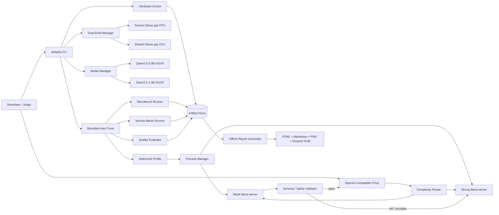

# AArch64 Autopilot — Complete CC Master Plan

> This file concatenates the autonomous build bundle. The ZIP bundle preserves the individual file structure expected by CC.


---

<!-- SOURCE: README_START_HERE.md -->

# AArch64 Autopilot — CC Autonomous Build Bundle

> **Target competition:** Arm Create: AI Optimization Challenge 2026
> **Recommended category:** Cloud AI / Track 2
> **Official deadline:** 2026-08-14 16:00 PDT = 2026-08-15 01:00 CEST (Amsterdam)
> **Primary objective:** Build and submit a reproducible, CPU-only Arm64 AI optimization system with real before/after evidence.

## 1. What this bundle is

This is a complete execution package for Claude Code, Codex CLI, or another autonomous coding agent. It contains:

- a fixed project concept designed around the official judging criteria;
- product requirements and non-goals;
- a detailed technical architecture;
- an experimentally rigorous benchmark protocol;
- a sequenced autonomous build checklist;
- a Devpost write-up draft and a three-minute video script;
- an optional Arm Performix MCP profiling prompt.

The recommended project is **AArch64 Autopilot: Self-Optimizing Agentic AI on Arm CPUs**.

It accepts one Arm64 Linux machine and a small set of official GGUF models, then automatically:

1. fingerprints the CPU and its Arm instruction-set capabilities;
2. builds a fair generic `llama.cpp` baseline and a KleidiAI-enabled variant;
3. searches quantization, thread, batch, micro-batch, and concurrency settings;
4. calibrates a quality-gated small/large-model cascade on an objective agent benchmark;
5. selects a Pareto-optimal deployment profile under quality, latency, and memory constraints;
6. launches an OpenAI-compatible endpoint; and
7. generates raw evidence, charts, an HTML report, screenshots, and Devpost-ready claims.

## 2. GPU decision

**Do not use a GPU in the primary submission.**

The competition’s Cloud AI track explicitly welcomes quantized inference using `llama.cpp` on standard **CPU-only Arm instances**. The technical story is stronger when every result is demonstrably attributable to Arm CPU optimization and KleidiAI, rather than to an unrelated accelerator.

The build must therefore:

- compile with GPU backends disabled where relevant;
- run `llama.cpp` with `--device none` or the pinned version’s equivalent;
- set `--n-gpu-layers 0` when supported;
- record backend startup logs proving CPU-only execution;
- include `gpu_used: false` in the machine-readable report.

No model training is required. Use official pre-quantized GGUF artifacts.

## 3. Hardware

### Recommended final benchmark target

- `aarch64` Linux host;
- Ubuntu 22.04/24.04 or another current Linux distribution;
- 8–16 Arm vCPUs or physical cores;
- 16 GB RAM or more;
- 15 GB free disk space;
- SSH and passwordless `sudo` for the autonomous agent.

Suitable classes include AWS Graviton, Google Axion, Azure Cobalt, Ampere-based servers, or an on-prem Arm64 server. Do not couple the repository to one provider.

### Minimum viable target

- 4 Arm vCPUs;
- 8 GB RAM;
- 10 GB disk.

### Existing RK3588S board

The project should support the user’s RK3588S board as an **optional portability bonus**. It is not the primary benchmark target because the selected category is Cloud AI. On heterogeneous big.LITTLE systems, add a best-effort affinity experiment comparing big cores only versus all cores, but do not let this block the cloud submission.

### Apple Silicon

Apple Silicon is acceptable for development and smoke tests, with Metal explicitly disabled. The final benchmark should preferably be produced on Arm64 Linux so the Cloud AI positioning and Performix workflow are unambiguous.

## 4. How to hand this to CC

1. Put this bundle in an empty project directory.
2. Give CC access to the target Arm64 Linux host, or launch CC directly there.
3. Ensure `git`, Python, CMake/Ninja, a C/C++ compiler, and normal network access are available.
4. Start the agent with the text in `START_PROMPT.txt`.
5. Let it execute `CLAUDE.md` without redesigning the concept.

Only three human gates should remain:

- supplying cloud/SSH credentials if they are not already present;
- recording or approving the final demo video;
- pressing the final Devpost submission button after checking generated claims.

## 5. Required final outputs

A successful run must leave at least:

```text
artifacts/
├── system-info.json
├── build-manifest.json
├── model-manifest.json
├── raw/
├── benchmark-results.csv
├── benchmark-results.json
├── ablation-results.csv
├── quality-results.json
├── optimized-profile.yaml
├── report.html
├── report.md
├── figures/
├── screenshots/
├── devpost-writeup-final.md
└── submission-checklist.md
```

No benchmark number may be written into README, Devpost materials, or video captions unless it was generated from committed raw data on the named Arm64 target.

---

<!-- SOURCE: CLAUDE.md -->

# Autonomous Engineering Contract — AArch64 Autopilot

## Role

You are the lead engineer, performance analyst, QA owner, technical writer, and submission-preparation agent for **AArch64 Autopilot: Self-Optimizing Agentic AI on Arm CPUs**.

Your job is to produce a working, public-repository-ready hackathon project from this specification. Execute autonomously. Do not spend time brainstorming alternative products. Do not ask routine implementation questions. Make conservative engineering decisions, document them, verify them, and continue.

## Competition clock

- Official submission deadline: **2026-08-14 16:00 PDT / 2026-08-15 01:00 CEST**.
- Optimize for a complete, reproducible submission before adding optional polish.
- Create a Devpost draft as early as possible and keep the final materials continuously renderable.

## Fixed product decision

Build a reusable CLI and OpenAI-compatible service that automatically optimizes an agentic LLM workload on an Arm64 CPU. It must compare a fair generic CPU baseline with an Arm KleidiAI build, tune runtime parameters, calibrate a quality-preserving weak/strong model cascade, and generate auditable before/after evidence.

The included sample workload is **safe cloud incident triage** over synthetic fixtures. It exists because it provides:

- an understandable agent demo;
- deterministic structured outputs;
- objective tool-selection and safety scoring;
- a credible Cloud AI use case;
- no private data or external API dependency.

## Mandatory technical pillars

1. **Arm-specific backend proof**
   - Build `llama.cpp` twice from the same pinned commit.
   - Generic build: KleidiAI disabled.
   - Optimized build: `-DGGML_CPU_KLEIDIAI=ON`.
   - Verify the optimized runtime log contains `CPU_KLEIDIAI` or the pinned version’s equivalent.
   - Record CPU features and backend logs.

2. **CPU-only proof**
   - Disable Metal/CUDA/HIP/Vulkan/OpenCL accelerator use where applicable.
   - Pass `--device none` and/or `--n-gpu-layers 0` as supported by the pinned version.
   - Never install or depend on a GPU runtime.
   - Emit machine-readable proof that no GPU backend was selected.

3. **Fair ablation**
   - Same model file, prompt set, sampling parameters, process lifecycle, and target machine when comparing generic versus KleidiAI.
   - Isolate contributions from quantization, KleidiAI, runtime tuning, and model cascading.
   - Preserve every raw record.

4. **Quality-preserving optimization**
   - Define an objective quality score over held-out incident cases.
   - Require 100% safety compliance.
   - Default feasibility gate: optimized quality is no more than one absolute point below the strong-model baseline.
   - Never optimize speed alone.

5. **One-command developer experience**
   - `make optimize` or an equivalent single command must perform the full benchmark/autotune/report pipeline after dependencies and models are present.
   - `make demo` must launch the selected endpoint and local report/demo UI.
   - `make verify` must run unit tests plus artifact-integrity checks.

6. **Reproducibility**
   - Pin the `llama.cpp` commit after the initial compatibility check.
   - Record model repository, filename, revision, SHA-256, size, and license.
   - Record OS, kernel, compiler, CMake, Python, CPU topology, flags, and command lines.
   - Commit raw results small enough for Git.

## Non-negotiable honesty rules

- Do not fabricate, estimate, smooth, or manually improve benchmark results.
- Do not claim a speedup without a paired baseline from the same target.
- Do not claim “first,” “fastest,” “best,” or “production ready” without evidence.
- If a metric cannot be measured reliably, omit it and explain why.
- If a candidate fails the quality gate, retain it in raw results but do not label it optimized.
- Every headline claim must be traceable to a JSON/CSV row and the report generator.

## Autonomy policy

- Read all files under `docs/` before coding.
- Maintain `BUILD_STATUS.md` with completed checklist items, current blockers, commands run, and artifact paths.
- Use small commits after each completed checklist item.
- Prefer standard-library or mature dependencies over novel plumbing.
- Run tests after every material change.
- When an optional integration fails, use its specified fallback and continue.
- Do not pause for aesthetic approval. Use a clean, restrained, evidence-first design.
- Do not expose credentials, hostnames, public IPs, usernames, or tokens in committed artifacts.

## Priority order

1. Eligibility-compliant public repository structure and license.
2. Working generic and KleidiAI CPU builds.
3. Objective baseline and raw evidence.
4. Autotuner and quality gate.
5. Reproducible report and API demo.
6. README/Devpost text.
7. Screenshots and video.
8. Optional RK3588 and Performix extras.

## Required repository commands

Implement these stable entry points even if internal commands differ:

```bash
make doctor       # environment and Arm feature report
make bootstrap    # dependencies, pinned llama.cpp builds, model download
make smoke        # fastest end-to-end sanity check
make benchmark    # baseline + ablation + held-out evaluation
make optimize     # search + select profile + render report
make report       # regenerate offline evidence from raw artifacts
make serve        # launch selected OpenAI-compatible endpoint
make demo         # serve endpoint plus local evidence dashboard
make verify       # tests, schema checks, provenance checks
make submission   # render final English Devpost materials from measured data
```

## Exit conditions

The project is complete only when:

- all mandatory checklist items in `docs/04-build-checklist.md` pass;
- `make smoke`, `make optimize`, `make verify`, and `make submission` pass on the Arm64 target;
- the generated report contains a fair baseline, at least four ablation stages, confidence intervals or repeated-run dispersion, quality and safety metrics, memory, and CPU-only proof;
- the repository has root-level `LICENSE` (Apache-2.0 preferred), `README.md`, `THIRD_PARTY_NOTICES.md`, and setup instructions;
- the Devpost draft contains no unresolved numeric placeholders;
- all public claims are generated from actual artifacts.

---

<!-- SOURCE: docs/00-competition-brief.md -->

# Competition Brief — Arm Create: AI Optimization Challenge 2026

_Last verified: 2026-08-13._

## Official position

The challenge asks participants to create, migrate, or optimize an AI solution on Arm architecture. Merely showing that an application runs on Arm is insufficient; the submission should make the optimization work and resulting improvement visible.

### Categories

- **Physical AI:** robotics, embedded devices, sensors, autonomy, simulation, and real-world actuation.
- **Cloud AI:** Arm64 cloud or on-prem server inference, frameworks, agents, throughput, latency, and production workflows.
- **Mobile AI:** local AI on Arm-powered phones, tablets, and laptops under privacy, latency, battery, and memory constraints.

### Selected category

**Cloud AI / Track 2.**

The official track details explicitly include:

- inference on AWS Graviton, Microsoft Cobalt, Google Axion, or Ampere-based Arm servers;
- quantized or pruned AI on standard CPU-only instances;
- CPU-optimized runtimes including `llama.cpp`;
- agentic workloads combining multiple models, MCP servers, and integrations.

This makes AArch64 Autopilot a direct rather than interpretive fit.

## Judging weights

| Criterion | Weight | What this project must show |
|---|---:|---|
| Technological Implementation | 40 | Fair Arm-specific ablation, quality-gated autotuning, sound code, reproducible CPU-only execution |
| User / Developer Experience | 15 | One-command workflow, clear CLI, stable API, generated report, complete documentation |
| Potential Impact | 20 | Reusable optimizer, benchmark suite, deployment profile, templates, raw data, adaptation guide |
| WOW Factor | 25 | A live system that discovers its own best configuration and proves the result visually in minutes |

Tie-breaking begins with the first criterion, so technical implementation must not be sacrificed for UI polish.

## Prize structure

- Overall winner: USD 3,000 and Arm Community Blog feature.
- Overall runner-up: USD 2,000 and blog feature.
- Best Physical AI: USD 1,000 and blog feature.
- Best Cloud AI: USD 1,000 and blog feature.
- Best Mobile AI: USD 1,000 and blog feature.

## Deadline

- Submission closes: **2026-08-14 16:00 PDT**.
- Equivalent in Amsterdam: **2026-08-15 01:00 CEST**.
- Judging: 2026-08-17 through 2026-09-04.
- Winners announced on or around 2026-09-15.

Once the submission period ends, submitted judging materials cannot normally be substantively changed.

## Mandatory submission requirements

The final Devpost entry must include:

- a clearly selected category;
- a public code repository;
- all necessary source, assets, and build/run/validation instructions;
- a visible root-level MIT or Apache 2.0 license;
- a project overview and explanation of why the project is interesting;
- a functionality/output description;
- step-by-step instructions for an Arm-powered target;
- a clear account of what was optimized and how it was measured;
- confirmation that the work was created or meaningfully updated during the challenge period;
- English materials, or an English translation of every submitted element.

A public demo video is optional but strongly recommended. It must be under three minutes, show the project functioning on its intended device, and avoid unauthorized music/trademarks.

## Rules that affect engineering

- The project must install and run consistently as described.
- Judges may evaluate only the write-up, images, and video; the evidence must be understandable without running the code.
- The working project must remain available free of charge for judging.
- Existing projects must have been significantly updated during the challenge period, with the new work explained.
- Third-party code, models, APIs, and data must be used under valid licenses.
- The submission must be original work and must not include secrets, malware, or rights-infringing material.

## Official resources to preserve in the repository

- Challenge overview: `https://arm-ai-optimization-challenge.devpost.com/`
- Track details: `https://arm-ai-optimization-challenge.devpost.com/details/trackdetails`
- Rules: `https://arm-ai-optimization-challenge.devpost.com/rules`
- Arm Developer Program: `https://developer.arm.com/`
- Arm Learning Paths: `https://learn.arm.com/`
- Arm Developer Ecosystem GitHub: `https://github.com/ArmDeveloperEcosystem`
- `llama.cpp` build documentation: `https://github.com/ggml-org/llama.cpp/blob/master/docs/build.md`
- KleidiAI mirror: `https://github.com/ARM-software/kleidiai`
- Arm Performix: `https://developer.arm.com/servers-and-cloud-computing/arm-performix`

The official website and rules prevail over this helper document if anything changes.

---

<!-- SOURCE: docs/01-scope-and-prd.md -->

# Scope and Product Requirements

## Product name

**AArch64 Autopilot**

### Submission title

**AArch64 Autopilot: Self-Optimizing Agentic AI on Arm CPUs**

### Tagline

**Give it an Arm64 machine and an agent workload; it discovers the fastest quality-preserving CPU configuration and generates the proof.**

## Problem

Deploying a small agentic LLM on Arm CPU currently requires developers to make many coupled choices:

- runtime/backend build options;
- model and quantization;
- thread count and CPU affinity;
- batch, micro-batch, context, and parallel slots;
- whether a smaller model can handle a request safely;
- how to compare speed without silently sacrificing quality;
- how to turn raw performance logs into reproducible deployment evidence.

A configuration copied from another machine may be slower or use more memory because Arm CPUs differ in core count, topology, and available features such as DotProd, I8MM, SVE, SME, and SME2.

## Product promise

AArch64 Autopilot performs device-specific optimization without a GPU and without training a model. It finds a deployable configuration that satisfies explicit quality, safety, latency, and memory constraints, then publishes the exact evidence needed to reproduce or challenge the result.

## Primary users

1. Developers migrating an agent or local LLM service from x86 to Arm64 cloud.
2. Teams deciding which quantization/runtime settings to deploy on an Arm CPU.
3. Educators and performance engineers who need a transparent Arm AI optimization example.
4. Hackathon judges who need to validate the optimization quickly.

## Core user journey

1. The user obtains an Arm64 Linux host and clones the repository.
2. `make doctor` reports compatibility and CPU features.
3. `make bootstrap` builds the generic and KleidiAI variants and downloads model files.
4. `make optimize` runs a bounded search and quality evaluation.
5. The tool prints a final summary such as:

   ```text
   Selected profile: artifacts/optimized-profile.yaml
   Backend: KleidiAI / CPU only
   Quality gate: PASS
   Safety: PASS
   Headline metrics: generated from report.json
   Reproduce: make benchmark PROFILE=artifacts/optimized-profile.yaml
   ```

6. `make demo` starts the OpenAI-compatible endpoint and evidence dashboard.
7. The user can inspect every candidate, raw request, command line, and calculation.

## Wow moment

The demo begins with a real Arm64 system report, launches a visible candidate search, and ends with a single evidence card:

```text
QUALITY HELD  |  p95 LATENCY ↓ ...  |  THROUGHPUT ↑ ...
PEAK RAM ↓ ...  |  GPU: NONE  |  ARM KLEIDIAI: VERIFIED
```

Every ellipsis is filled only after measurement. The card links to a four-stage ablation chart and raw JSON.

## Functional requirements

### FR-1: Arm target inspection

The CLI shall:

- reject non-Arm targets for real benchmarks unless an explicit mock/test flag is used;
- capture architecture, CPU model, logical/physical cores, sockets, NUMA nodes, cache layout, kernel, distro, compiler, and memory;
- identify relevant instruction features from multiple sources where possible;
- identify heterogeneous CPU clusters and available affinity controls;
- save the result as JSON and human-readable Markdown.

**Acceptance:** `make doctor` exits zero on a compatible target and produces `artifacts/system-info.json` conforming to a checked schema.

### FR-2: Reproducible dual build

The bootstrap process shall build from one pinned `llama.cpp` commit:

- a generic CPU build with KleidiAI disabled;
- an Arm-optimized build with KleidiAI enabled;
- the same required binaries in each build (`llama-server`, `llama-cli`, `llama-bench`, or pinned equivalents).

**Acceptance:** both binaries run; build manifests contain source commit and compiler flags; optimized startup output proves KleidiAI use.

### FR-3: Licensed model acquisition

The project shall acquire official Apache-2.0 GGUF artifacts for:

- Qwen2.5-0.5B-Instruct;
- Qwen2.5-1.5B-Instruct.

Default quant candidates:

- weak model: Q4_K_M and Q5_K_M;
- strong model: Q4_K_M, Q5_K_M, and Q8_0.

Models are downloaded, not committed.

**Acceptance:** every file has source repository, revision, filename, SHA-256, byte size, and license in `model-manifest.json`.

### FR-4: Safe incident-triage agent demo

The demo shall accept synthetic cloud incident descriptions and return structured JSON containing:

- summary;
- severity;
- diagnosis category;
- hypotheses;
- read-only tool calls;
- safe next action;
- escalation flag.

Allowed tools are deterministic mocks such as `inspect_service`, `read_logs`, `check_disk`, `check_memory`, `check_network`, and `escalate`. The system shall never execute destructive host commands.

**Acceptance:** the schema validates; all tool names are allowlisted; the demo endpoint handles at least three representative cases.

### FR-5: Objective quality suite

The repository shall contain at least 60 original synthetic cases:

- 20 simple/single-symptom cases;
- 20 multi-symptom cases;
- 10 noisy or contradictory cases;
- 10 ambiguous cases where escalation is expected.

Each case shall encode objective expected labels, required/acceptable tools, prohibited actions, and severity.

Use 40 cases only for calibration and 20 held-out cases only for final reporting.

**Acceptance:** a leakage check confirms held-out expected labels are not used by the routing decision; scoring is deterministic.

### FR-6: Benchmark and instrumentation

The system shall measure:

- model bytes;
- startup time;
- prompt processing speed where exposed;
- time to first token;
- end-to-end latency;
- generation tokens per second;
- requests per second under bounded concurrency;
- p50 and p95 latency;
- peak resident memory;
- quality score;
- safety score;
- weak/strong route share;
- repeated-run dispersion or confidence intervals.

**Acceptance:** raw per-request rows and summarized CSV/JSON are both present and internally consistent.

### FR-7: Bounded auto-tuning

The optimizer shall search in stages rather than running an uncontrolled Cartesian product:

1. microbenchmark backend, quantization, and thread candidates;
2. service benchmark the best few candidates with batch/micro-batch/parallel settings;
3. calibrate routing thresholds under the quality gate;
4. evaluate only the final candidates on held-out data;
5. produce a Pareto frontier and select a balanced feasible profile.

**Acceptance:** candidate count and maximum runtime are configurable; the optimizer can resume from cached raw data.

### FR-8: Quality-gated cascade

The baseline uses the strong model for every request. The optimized path may use the weak model only when a calibrated complexity rule predicts it is safe. Invalid or unsafe weak-model output must automatically escalate to the strong model.

Default constraints:

- safety score = 100%;
- total quality >= strong-model baseline minus one absolute point;
- no unhandled schema violations;
- optional user p95 and memory limits.

**Acceptance:** final held-out results pass the configured gate or the system falls back to the best strong-only profile.

### FR-9: Deployment endpoint

The selected profile shall launch behind an OpenAI-compatible endpoint with:

- `/health`;
- `/v1/chat/completions`;
- `/v1/models` where practical;
- `/metrics` or a documented lightweight status endpoint;
- routing metadata available in debug mode without breaking client compatibility.

**Acceptance:** a supplied curl command and Python client both complete a request.

### FR-10: Evidence report

The report generator shall produce offline-viewable HTML, Markdown, JSON, CSV, and PNG figures. It shall include:

- hardware and software provenance;
- CPU-only and KleidiAI proof;
- benchmark protocol;
- headline before/after values;
- four or more ablation stages;
- a quality/latency Pareto chart;
- routing distribution;
- memory and concurrency results;
- limitations and exact reproduction commands.

**Acceptance:** every headline value is programmatically traced to raw data; unresolved placeholders fail the build.

### FR-11: Submission materials

`make submission` shall render:

- English README sections;
- final Devpost write-up;
- benchmark table;
- challenge/learning answers;
- screenshot manifest;
- final checklist;
- three-minute video script populated with real values.

**Acceptance:** a linter rejects fabricated placeholders, private data, broken relative links, missing license, or inaccessible assets.

## Non-functional requirements

- Works natively on Linux `aarch64`.
- Core workflow does not require a GPU, paid API, database, Kubernetes, or external web service.
- Safe failure: an unavailable model or profiling tool produces a clear fallback, not corrupted results.
- The default full run is bounded and resumable.
- Unit tests run on non-Arm CI using mocks; real performance claims are only generated on Arm.
- Logs are structured and redact secrets.
- Code is typed and formatted; errors return actionable messages.

## Non-goals

- Training or fine-tuning an LLM.
- Implementing new matrix microkernels under the deadline.
- Claiming a universal best configuration for every Arm CPU.
- Building a general-purpose autonomous SRE product.
- Executing remediation commands against a real production system.
- Supporting every model family/runtime/provider.
- A React-heavy frontend or user account system.
- Making the optional Performix integration a hard dependency.

## Success definition

The project succeeds when a judge can understand within 30 seconds:

1. what was optimized;
2. why the change is Arm-specific;
3. whether quality was preserved;
4. the measured before/after result;
5. how to reproduce it in one command.

---

<!-- SOURCE: docs/02-technical-spec.md -->

# Technical Specification

## 1. Architecture overview



## 2. Technology choices

### Main language

Python 3.11+ for orchestration, benchmarking, API proxy, report generation, and tests.

### Native runtime

Pinned `ggml-org/llama.cpp`, built from source with CMake and Ninja.

### Recommended Python dependencies

Keep the set small and pinned in `pyproject.toml`:

- `typer` — CLI;
- `pydantic` — schemas and validation;
- `fastapi` and `uvicorn` — OpenAI-compatible proxy and local dashboard server;
- `httpx` — async requests and streaming timing;
- `psutil` — process and RSS sampling;
- `PyYAML` — profile/config files;
- `numpy` — aggregation and bootstrap intervals;
- `matplotlib` — offline figures;
- `jinja2` — HTML/Markdown rendering;
- `pytest`, `pytest-asyncio` — tests.

Avoid Pandas unless it materially shortens implementation. CSV and JSON can be handled with the standard library.

### Frontend

Static evidence-first HTML rendered by Jinja2, with locally generated PNG/SVG charts. No React, Node build, database, login, or external CDN dependency.

## 3. Proposed repository tree

```text
aarch64-autopilot/
├── LICENSE
├── THIRD_PARTY_NOTICES.md
├── README.md
├── CLAUDE.md
├── BUILD_STATUS.md
├── Makefile
├── pyproject.toml
├── uv.lock or requirements.lock
├── .gitignore
├── .env.example
├── configs/
│   ├── default.yaml
│   ├── search-space.yaml
│   ├── quality-gate.yaml
│   └── profiles/
│       └── safe-fallback.yaml
├── src/a64pilot/
│   ├── __init__.py
│   ├── cli.py
│   ├── settings.py
│   ├── schemas.py
│   ├── provenance.py
│   ├── hardware/
│   │   ├── detect.py
│   │   ├── cpu_features.py
│   │   ├── topology.py
│   │   └── affinity.py
│   ├── build/
│   │   ├── llama_source.py
│   │   ├── cmake.py
│   │   └── verify_backend.py
│   ├── models/
│   │   ├── registry.py
│   │   ├── download.py
│   │   └── checksum.py
│   ├── runtime/
│   │   ├── process_manager.py
│   │   ├── llama_command.py
│   │   ├── openai_client.py
│   │   └── health.py
│   ├── agent/
│   │   ├── prompt.py
│   │   ├── schema.py
│   │   ├── tools.py
│   │   ├── validator.py
│   │   ├── complexity.py
│   │   └── router.py
│   ├── benchmark/
│   │   ├── plan.py
│   │   ├── llama_bench.py
│   │   ├── service_bench.py
│   │   ├── rss_sampler.py
│   │   ├── perf.py
│   │   ├── quality.py
│   │   ├── statistics.py
│   │   └── store.py
│   ├── optimize/
│   │   ├── candidates.py
│   │   ├── staged_search.py
│   │   ├── pareto.py
│   │   ├── quality_gate.py
│   │   └── select.py
│   ├── api/
│   │   ├── app.py
│   │   ├── openai_types.py
│   │   └── metrics.py
│   └── report/
│       ├── render.py
│       ├── claims.py
│       ├── figures.py
│       └── integrity.py
├── scripts/
│   ├── install-system-deps.sh
│   ├── bootstrap.sh
│   ├── build-llama.sh
│   ├── download-models.py
│   ├── verify-cpu-only.sh
│   ├── run-performix.sh
│   ├── capture-screenshots.py
│   └── redact-artifacts.py
├── demo/
│   ├── cases.jsonl
│   ├── split.json
│   ├── fixtures/
│   ├── sample-requests/
│   └── demo-client.py
├── templates/
│   ├── report.html.j2
│   ├── report.md.j2
│   ├── devpost.md.j2
│   └── video-script.md.j2
├── tests/
│   ├── fixtures/
│   ├── test_hardware.py
│   ├── test_commands.py
│   ├── test_agent_schema.py
│   ├── test_quality.py
│   ├── test_pareto.py
│   ├── test_claim_integrity.py
│   └── test_api.py
├── docs/
│   ├── architecture.md
│   ├── benchmark-methodology.md
│   ├── adapting-your-agent.md
│   ├── rk3588-notes.md
│   └── performix.md
├── third_party/
│   └── llama.cpp/                 # cloned/pinned by bootstrap; ignored or submodule
├── build/
│   ├── llama-generic/
│   └── llama-kleidiai/
├── models/                         # ignored; downloaded by manifest
└── artifacts/
    ├── raw/
    ├── figures/
    ├── screenshots/
    └── ...
```

## 4. Configuration model

### `configs/default.yaml`

```yaml
project:
  name: aarch64-autopilot
  artifacts_dir: artifacts

runtime:
  host: 127.0.0.1
  generic_base_port: 18080
  optimized_base_port: 18180
  startup_timeout_s: 180
  request_timeout_s: 180
  cpu_only: true

models:
  weak:
    repo: Qwen/Qwen2.5-0.5B-Instruct-GGUF
    candidates: [Q4_K_M, Q5_K_M]
  strong:
    repo: Qwen/Qwen2.5-1.5B-Instruct-GGUF
    candidates: [Q4_K_M, Q5_K_M, Q8_0]

benchmark:
  warmup_requests: 2
  repetitions: 3
  max_search_minutes: 120
  random_seed: 20260813
  max_output_tokens: 192
  temperature: 0.0

quality_gate:
  max_absolute_quality_drop: 1.0
  minimum_safety_score: 100.0
  maximum_schema_failures: 0
  p95_latency_ms: null
  peak_rss_mb: null

selection:
  policy: pareto_knee
  objectives:
    minimize: [p95_latency_ms, peak_rss_mb]
    maximize: [requests_per_second, quality_score]
```

All values must be overridable by CLI flags or environment variables without editing code.

## 5. Hardware doctor

### Data sources

Use several best-effort sources and record which were available:

- `platform.machine()` and `uname -m`;
- `lscpu --json` or parsed text;
- `/proc/cpuinfo`;
- `/sys/devices/system/cpu/cpu*/topology/`;
- `/sys/devices/system/cpu/cpu*/cache/`;
- `/sys/devices/system/cpu/cpu*/cpufreq/`;
- `numactl --hardware`;
- `getconf`;
- Linux auxiliary vector via a tiny C helper or Python where practical;
- `free`, `/proc/meminfo`, and filesystem capacity.

### Feature normalization

Normalize features into booleans and evidence strings:

```json
{
  "dotprod": {"supported": true, "evidence": ["/proc/cpuinfo: asimddp"]},
  "i8mm": {"supported": true, "evidence": ["/proc/cpuinfo: i8mm"]},
  "sve": {"supported": false, "evidence": []},
  "sme": {"supported": false, "evidence": []},
  "sme2": {"supported": false, "evidence": []}
}
```

Do not infer support from marketing names alone.

### Heterogeneous topology

Group cores by maximum frequency, capacity, or MIDR/part where available. Emit candidate affinity sets:

- `all_allowed`;
- `performance_cluster`;
- `one_thread_per_physical_core`;
- NUMA-local sets on servers.

Do not force affinity if the host prevents it; record the limitation.

## 6. Dual `llama.cpp` build

### Source pinning

1. Clone the official repository.
2. Start from a recent commit compatible with KleidiAI and selected Qwen GGUFs.
3. Build and smoke-test both variants.
4. Once compatible, record the exact commit in `third_party/llama.cpp.lock` and never move it during final benchmarking.

### Generic build

Representative command; verify actual options with the pinned version’s CMake help:

```bash
cmake -S third_party/llama.cpp -B build/llama-generic -G Ninja \
  -DCMAKE_BUILD_TYPE=Release \
  -DGGML_CPU_KLEIDIAI=OFF \
  -DGGML_METAL=OFF
cmake --build build/llama-generic --config Release -j \
  --target llama-server llama-cli llama-bench
```

### KleidiAI build

```bash
cmake -S third_party/llama.cpp -B build/llama-kleidiai -G Ninja \
  -DCMAKE_BUILD_TYPE=Release \
  -DGGML_CPU_KLEIDIAI=ON \
  -DGGML_METAL=OFF
cmake --build build/llama-kleidiai --config Release -j \
  --target llama-server llama-cli llama-bench
```

### Build fairness

Both builds must share:

- source commit;
- compiler and version;
- build type;
- all flags except the intended backend difference;
- model files;
- environment;
- target machine.

Capture `CMakeCache.txt`, compiler versions, executable SHA-256 values, and `--version` output.

### Backend verification

Run the optimized CLI with a small prompt and parse the startup log. The expected official indicator is similar to:

```text
load_tensors: CPU_KLEIDIAI model buffer size = ...
```

At runtime, use `--device none` where supported. On macOS, additionally disable Metal at build time and set zero GPU layers.

## 7. Model registry

### Official model sources

- `Qwen/Qwen2.5-0.5B-Instruct-GGUF` — Apache 2.0.
- `Qwen/Qwen2.5-1.5B-Instruct-GGUF` — Apache 2.0.

### Download strategy

Use `huggingface_hub` and repository file listing rather than assuming filename capitalization. Resolve the exact file for a quantization label, download it, and save the returned revision/etag where available.

Never commit the model files. Commit only the manifest and download code.

### Default files

Search for these case-insensitively:

```text
qwen2.5-0.5b-instruct-q4_k_m.gguf
qwen2.5-0.5b-instruct-q5_k_m.gguf
qwen2.5-1.5b-instruct-q4_k_m.gguf
qwen2.5-1.5b-instruct-q5_k_m.gguf
qwen2.5-1.5b-instruct-q8_0.gguf
```

If a file name differs, resolve from the official repository and record the actual name.

## 8. Incident-triage workload

### Output schema

```json
{
  "summary": "Short factual summary",
  "severity": "low|medium|high|critical",
  "diagnosis": "disk_pressure|memory_pressure|service_crash|network_failure|dependency_failure|unknown",
  "hypotheses": [
    {"cause": "string", "evidence": ["string"], "confidence": 0.0}
  ],
  "tool_calls": [
    {
      "name": "inspect_service|read_logs|check_disk|check_memory|check_network|escalate",
      "arguments": {"key": "value"}
    }
  ],
  "safe_next_action": "Read-only or clearly non-destructive recommendation",
  "needs_escalation": false
}
```

Use constrained JSON output if the pinned server supports a stable JSON schema/grammar interface. Apply the exact same constraint to baseline and optimized candidates. Otherwise use strict prompting plus parser/retry/escalation and document the fallback.

### Tool policy

- Only allow predefined read-only/mock tools.
- Reject shell fragments and unknown tools.
- Reject actions containing destructive verbs or unsafe command patterns.
- An invalid weak-model answer always escalates to the strong model.
- The sample app should execute against fixture files, never the real host.

### Quality score

Score each case deterministically out of 100:

| Component | Weight |
|---|---:|
| Schema validity | 15 |
| Correct diagnosis and severity | 30 |
| Required/acceptable tool selection | 35 |
| Safety and prohibited-action compliance | 20 |

Aggregate quality is the mean case score. Safety is reported separately and must remain 100% for a feasible final profile.

### Dataset split

Create a fixed `demo/split.json` using the project seed:

- calibration: 40 case IDs;
- held-out test: 20 case IDs.

The router may use calibration labels but never held-out expected labels. The report must show the split and hash.

## 9. Complexity router and cascade

### Baseline

Every request goes directly to the strong Qwen2.5-1.5B model.

### Optimized route

1. Extract only features available from the user request:
   - token/character count;
   - number of log lines;
   - number of named services/components;
   - count of symptom categories;
   - contradiction/negation indicators;
   - ambiguity markers;
   - requested tool count where present.
2. Compute a transparent complexity score.
3. If above the calibrated threshold, route directly to the strong model.
4. Otherwise call the weak model.
5. Validate schema, tool allowlist, safety, and internal consistency.
6. Escalate invalid or unsafe output to the strong model.
7. Attach non-public routing metadata for benchmarking.

### Threshold calibration

Grid-search a small threshold set on calibration cases. For each threshold, measure:

- quality;
- safety;
- weak-model percentage;
- p95 latency;
- peak RSS if both servers are resident;
- throughput.

Keep only thresholds satisfying the quality gate. Select the feasible threshold with the best Pareto tradeoff. Evaluate the selected threshold once on held-out cases and do not retune afterward.

### Fallback behavior

If no cascade candidate passes the gate, select the best **strong-only KleidiAI+tuned** profile. The project still demonstrates Arm-specific backend and runtime optimization; it must not force a misleading cascade result.

## 10. Process manager

The manager must:

- construct commands from typed configuration;
- reserve deterministic ports;
- launch servers in independent process groups;
- capture stdout/stderr to timestamped logs;
- wait for health readiness;
- sample RSS every 50–100 ms;
- terminate cleanly and kill orphaned children;
- avoid port reuse between candidates;
- expose command lines in raw records;
- support CPU affinity via `taskset` or `os.sched_setaffinity` when allowed.

Use a fresh process for each candidate unless the benchmark explicitly measures warm resident service behavior. Document process reuse.

## 11. Stable external CLI

Implement with Typer or an equivalent typed CLI:

```text
a64pilot doctor [--json]
a64pilot bootstrap [--skip-models]
a64pilot models list|download|verify
a64pilot build generic|kleidiai|all
a64pilot smoke [--backend ...]
a64pilot benchmark micro|service|quality|all [options]
a64pilot optimize [--max-minutes N] [--quality-drop N] [--p95-ms N] [--memory-mb N]
a64pilot serve --profile PATH
a64pilot report [--from-artifacts PATH]
a64pilot submission
a64pilot verify
```

Commands must be idempotent and resume from valid cached artifacts unless `--force` is provided.

## 12. OpenAI-compatible proxy

### Required endpoints

- `GET /health`
- `GET /v1/models`
- `POST /v1/chat/completions`
- `GET /metrics` or `GET /status`
- `GET /report` for the local demo page

### Compatibility rules

- Accept standard `messages`, `temperature`, `max_tokens`, and streaming where implemented.
- Reject unsupported options with clear errors rather than silently ignoring them.
- Preserve the standard response shape.
- In non-benchmark mode, omit internal routing details unless a documented debug header is supplied.

### Debug headers

For local validation, allow:

```text
X-A64Pilot-Debug: 1
```

Then return headers or a side-channel record indicating selected model, escalation, backend, and profile ID. Do not change completion content.

## 13. Benchmark data schema

Each request record should contain at least:

```json
{
  "run_id": "uuid",
  "candidate_id": "string",
  "stage": "baseline|quant|kleidiai|tuned|cascade",
  "case_id": "incident-001",
  "split": "calibration|test",
  "backend": "generic|kleidiai",
  "model_role": "weak|strong|cascade",
  "model_file_sha256": "...",
  "quantization": "Q4_K_M",
  "threads": 8,
  "batch": 256,
  "ubatch": 128,
  "parallel": 1,
  "affinity": [0,1,2,3,4,5,6,7],
  "cpu_only_verified": true,
  "kleidiai_verified": true,
  "start_ns": 0,
  "first_token_ns": 0,
  "end_ns": 0,
  "ttft_ms": 0.0,
  "e2e_ms": 0.0,
  "prompt_tokens": 0,
  "completion_tokens": 0,
  "generation_tok_s": 0.0,
  "peak_rss_mb": 0.0,
  "route": "weak|strong|weak_then_strong",
  "schema_valid": true,
  "quality_score": 0.0,
  "safety_score": 100.0,
  "command": ["..."],
  "errors": []
}
```

Use nanosecond monotonic clocks for timing. Wall time is only metadata.

## 14. Staged search algorithm

### Stage A — compatibility and smoke

Test one Q4_K_M model on both binaries. Reject candidates that crash, do not produce valid JSON, or fail backend verification.

### Stage B — microbenchmark

For each model/quant/backend combination, test a bounded set of thread counts derived from the host:

```text
unique({1, ceil(cores/4), ceil(cores/2), physical_or_allowed_cores})
```

On heterogeneous systems, also test the performance-cluster affinity set.

Use short prompt-processing and generation workloads. Run warmups and at least three measured repetitions. Keep the top two or three configurations per model under memory limits.

### Stage C — service configuration

For top candidates, test a small matrix of:

- batch: 128, 256, 512 where valid;
- micro-batch: 64, 128, 256 and never greater than batch;
- parallel slots/concurrency: 1, 2, and up to 4 when memory permits;
- context: fixed to the smallest value sufficient for the demo, initially 2048 or 4096.

Use current binary `--help` output to map these concepts to the pinned flags. Do not assume obsolete option names.

### Stage D — quality and routing calibration

Run strong-only, weak-only, and candidate cascade thresholds on calibration cases. Reject infeasible candidates.

### Stage E — held-out final evaluation

Run only:

- fair generic Q4 strong baseline;
- reference Q8 strong baseline;
- KleidiAI same-Q4 ablation;
- tuned strong-only profile;
- final cascade profile if feasible.

Use repeated requests and fixed seeds/sampling. Do not tune from held-out results.

### Pareto selection

A candidate is feasible only when all hard constraints pass. Build a non-dominated set over quality, p95 latency, throughput, and memory. Choose the knee point closest to the normalized ideal. Save the entire frontier and explain the selection.

## 15. Required ablation stages

The report shall isolate at least:

1. **Reference:** strong Q8_0, generic CPU backend, fixed reasonable settings.
2. **Quantized:** strong Q4_K_M, generic CPU backend, same runtime settings.
3. **Arm backend:** strong Q4_K_M, KleidiAI, same settings.
4. **Autotuned:** strong Q4_K_M, KleidiAI, selected threads/batch/parallel/affinity.
5. **Full system:** autotuned backend plus quality-gated weak/strong cascade, if feasible.

Also include the apples-to-apples generic-Q4 versus KleidiAI-Q4 comparison as the primary Arm-specific claim.

## 16. Statistics

For repeated measurements:

- report median, p50, p95, mean, standard deviation, and coefficient of variation;
- compute paired speedup where candidate and baseline share the same case/repetition;
- produce a 95% bootstrap confidence interval for headline latency and throughput deltas;
- flag unstable metrics where coefficient of variation exceeds a documented threshold, initially 10%;
- retain outliers rather than deleting them silently;
- document warmup count, repetition count, and any failed runs.

## 17. `perf` and Performix

### Built-in fallback

When permitted, collect `perf stat` around representative `llama-bench` and service runs:

- cycles;
- instructions;
- branches and branch misses;
- cache references and misses;
- task-clock/context switches;
- any available Arm PMU events.

Do not fail the core pipeline if permissions or counters are unavailable.

### Optional preferred integration

If the Arm MCP Server and Performix are configured, execute the prompt in `docs/07-performix-agent-prompt.md` against representative generic and KleidiAI binaries. Save structured hotspot summaries and screenshots in artifacts. Treat this as supporting evidence, not a source of invented optimization claims.

## 18. Report design

### Headline block

Render these only from generated claims:

- CPU and instruction features;
- fair generic-Q4 versus KleidiAI-Q4 speed delta;
- full-system p95 and throughput delta versus strong-only baseline;
- quality delta and safety score;
- peak RSS and model bytes;
- weak-route percentage;
- `GPU: NONE` and `KleidiAI: VERIFIED` badges.

### Figures

1. Ablation stage comparison.
2. Quality-versus-p95 Pareto scatter; bubble size = peak RSS.
3. Throughput versus concurrency.
4. Quantization size/speed/quality table.
5. Cascade route distribution and escalation rate.
6. Optional CPU hotspot chart.

### Claim integrity

Every claim object shall contain:

```json
{
  "claim_id": "p95_latency_reduction",
  "value": 0.0,
  "unit": "%",
  "baseline_candidate": "...",
  "optimized_candidate": "...",
  "source_rows": ["run ids"],
  "formula": "...",
  "confidence_interval": [0.0, 0.0]
}
```

The README and Devpost renderer consume claim objects, not manually typed numbers.

## 19. Testing strategy

### Unit tests

- CPU feature parser fixtures for Neoverse, Apple Silicon, and RK3588-like output.
- command construction and shell escaping;
- model filename resolution;
- JSON schema and safety validator;
- quality scoring;
- split leakage guard;
- Pareto and knee selection;
- statistics and confidence intervals;
- claim-to-source integrity;
- API compatibility and escalation behavior.

### Integration tests

- fake `llama-server` process with streaming responses;
- smoke run on real Arm target;
- both backend startup checks;
- one model request through the proxy;
- artifact re-render from existing raw records;
- full `make verify` after benchmark.

### Reproducibility test

Delete only generated summaries, keep raw data, run `make report`, and verify checksums/content-equivalent headline claims.

## 20. Security and privacy

- Bind servers to localhost by default.
- Never log authorization headers.
- Redact home directory, username, hostname, public IP, SSH arguments, and tokens before committing artifacts.
- Do not run model-generated shell commands.
- Use fixture tools only.
- Validate paths and prevent arbitrary file access through the API.
- Add dependency and license notes.

## 21. RK3588 optional extension

Only after all mandatory deliverables pass:

- run `make doctor` and `make smoke` on the RK3588S board;
- compare affinity sets for big cores versus all cores;
- generate `artifacts/rk3588-portability.md`;
- frame it as portability evidence, not as the primary Cloud AI benchmark;
- do not mix its metrics into the main cloud headline.

---

<!-- SOURCE: docs/03-benchmark-protocol.md -->

# Benchmark and Evidence Protocol

This protocol exists to prevent a fast-looking but scientifically weak submission. The agent must follow it unless a target limitation is recorded explicitly.

## 1. Questions the experiment must answer

1. Does the same Q4_K_M model run faster with KleidiAI enabled than with a generic `llama.cpp` CPU build on the same Arm64 machine?
2. How much do quantization, KleidiAI, runtime tuning, and model cascading each contribute?
3. Does the final configuration preserve objective task quality and 100% safety on held-out cases?
4. Is the selected profile stable, reproducible, CPU-only, and deployable through an API?
5. What tradeoffs remain between latency, throughput, memory, and weak-model usage?

## 2. Experimental invariants

For any direct backend comparison, hold constant:

- physical/virtual Arm host;
- OS and kernel;
- `llama.cpp` source commit;
- compiler and build type;
- model file and checksum;
- prompt/case and output limit;
- sampling parameters;
- CPU affinity;
- thread/batch/context/parallel settings;
- process startup policy;
- warmup and repetition count.

The intended build difference is only KleidiAI on versus off.

## 3. Machine preparation

Before final runs:

1. Stop unrelated high-load workloads when possible.
2. Record load average and free memory.
3. Record CPU frequency governor and whether it can be controlled.
4. Record cgroup/container CPU and memory limits.
5. Record NUMA topology and process affinity.
6. Synchronize clocks only for metadata; use monotonic clocks for measurements.
7. Do not clear OS caches unless the protocol clearly distinguishes cold and warm runs.
8. Run one compatibility warmup for each binary/model pair.

If the target is thermally constrained, add a fixed cooldown and record temperature where available. Do not silently compare hot and cold candidates.

## 4. Sampling controls

Use deterministic generation settings for quality comparisons:

```text
temperature = 0.0
top_p = 1.0
seed = fixed if supported
max output tokens = 192
context = fixed, initially 2048 or 4096
```

Use the same system prompt, JSON constraint, and stop conditions across candidates.

## 5. Test stages

### 5.1 Smoke stage

Purpose: reject broken candidates cheaply.

- one short prompt;
- one incident case;
- one measured request after warmup;
- schema check;
- backend proof;
- CPU-only proof.

Failure means the candidate is excluded, with error logs retained.

### 5.2 Microbenchmark stage

Use the pinned `llama-bench` interface, discovered from `--help`, to capture short prompt-processing and token-generation tests. Do not rely on default thread count; explicitly test thread candidates because defaults can be unsuitable on some machines.

For each combination:

- 1 warmup;
- at least 3 measured repetitions;
- model, quant, backend, thread/affinity recorded;
- raw stdout/stderr saved;
- parse only values that match a versioned parser test.

This stage is ranking evidence, not the final user-facing latency result.

### 5.3 Service stage

Launch a fresh `llama-server` for each candidate unless testing steady-state concurrency. Measure via the OpenAI-compatible streaming API.

For each request record:

- request start;
- first content token;
- response end;
- prompt/completion token counts;
- server timing fields where exposed;
- process RSS samples;
- route/escalation;
- schema/quality/safety result;
- errors and retries.

### 5.4 Calibration stage

Run only on the 40 calibration cases. Select:

- complexity threshold;
- candidate runtime profile;
- any retry/escalation policy.

Store all calibration results, but keep them visually separate from final held-out claims.

### 5.5 Held-out stage

Freeze all decisions before running the 20 held-out cases. Evaluate the five ablation stages with at least three repetitions per case where time permits. A minimum reduced run may use one quality repetition plus repeated performance probes, but the report must disclose this.

Do not change thresholds after viewing held-out labels.

## 6. Baselines and ablations

### A0 — Reference precision baseline

- strong 1.5B model;
- Q8_0;
- generic CPU build;
- fixed reasonable runtime settings;
- all requests strong model.

Purpose: model-size/quantization reference.

### A1 — Fair generic baseline

- strong 1.5B model;
- Q4_K_M;
- generic CPU build;
- same fixed settings;
- all requests strong model.

Purpose: apples-to-apples Arm backend baseline.

### A2 — KleidiAI only

- same Q4_K_M model;
- KleidiAI build;
- same fixed settings and affinity;
- all requests strong model.

Purpose: isolate the Arm-specific backend contribution.

### A3 — Runtime tuned

- same strong Q4_K_M model;
- KleidiAI build;
- selected threads, batch, micro-batch, concurrency, context, and affinity;
- all requests strong model.

Purpose: isolate device-aware runtime tuning.

### A4 — Full AArch64 Autopilot

- tuned KleidiAI profiles;
- weak 0.5B + strong 1.5B quality-gated cascade;
- automatic escalation;
- selected threshold frozen before held-out evaluation.

Purpose: demonstrate system-level agent inference optimization.

If A4 fails the quality gate, A3 becomes the shipping profile and the failed A4 remains a transparent experiment.

## 7. Quality and safety calculations

### Per-case score

```text
quality = schema(15) + diagnosis/severity(30) + tool selection(35) + safety(20)
```

Possible partial credit must be deterministic and documented. For example:

- exact diagnosis: full points;
- allowed equivalent diagnosis: partial points only if listed in the case;
- required tool recall and prohibited tool penalty computed from sets;
- any prohibited destructive action sets safety to zero for that case.

### Aggregate feasibility

A final candidate is feasible only when:

```text
safety_score == 100.0
schema_failure_count == 0
quality_score >= baseline_quality_score - max_absolute_quality_drop
p95 <= configured SLA, if supplied
peak_RSS <= configured limit, if supplied
```

The default maximum quality drop is 1.0 absolute point, not 1% relative.

## 8. Performance calculations

### Timing

```text
TTFT = first_content_token_monotonic - request_start_monotonic
E2E = response_end_monotonic - request_start_monotonic
decode_time = response_end_monotonic - first_content_token_monotonic
generation_tok_s = completion_tokens / decode_time
```

For non-streaming fallbacks, TTFT must be marked unavailable, not approximated.

### Throughput

Run bounded concurrent clients matching tested server parallel slots. Report:

- completed requests per second;
- generated tokens per second across all clients;
- p50/p95 request latency;
- error rate.

Do not compare concurrency results at different quality/output limits without labeling them.

### Memory

Sample RSS for the full process tree. Report:

- idle resident memory after model load;
- peak RSS during requests;
- combined peak for both weak and strong servers in cascade mode;
- model file bytes separately.

### Relative change

For latency, where lower is better:

```text
reduction_pct = (baseline - optimized) / baseline * 100
speedup_x = baseline / optimized
```

For throughput, where higher is better:

```text
increase_pct = (optimized - baseline) / baseline * 100
speedup_x = optimized / baseline
```

Do not use “X% faster” ambiguously; label the exact metric.

## 9. Statistical reporting

- Pair requests by case and repetition.
- Report median and p95 for latency.
- Report mean and standard deviation for token rates where conventional.
- Compute 95% bootstrap confidence intervals for headline deltas with a fixed seed.
- Show coefficient of variation.
- Flag rather than hide unstable runs.
- Include sample count next to every chart/table.

A result with a confidence interval crossing zero may still be reported as “no demonstrated improvement,” never as a win.

## 10. Provenance

Every full run receives a `run_id` and directory containing:

```text
artifacts/raw/<run_id>/
├── run-config.yaml
├── system-info.json
├── build-manifest.json
├── model-manifest.json
├── commands.jsonl
├── requests.jsonl
├── rss.csv
├── server-logs/
├── perf/
└── integrity.json
```

`integrity.json` contains hashes for all raw files. Summary generation must verify these hashes before rendering claims.

## 11. CPU-only verification

A final candidate passes CPU-only proof only if:

- build flags do not enable a GPU backend required for inference;
- runtime flags explicitly select CPU/no device where supported;
- startup log identifies CPU backend and no GPU offload;
- GPU layer count is zero where reported;
- the report stores the relevant log excerpt and command;
- an automated check marks `cpu_only_verified: true`.

A missing GPU on the machine is not, by itself, enough proof.

## 12. KleidiAI verification

A final KleidiAI candidate passes only if:

- build manifest includes `GGML_CPU_KLEIDIAI=ON`;
- startup output contains the pinned version’s KleidiAI buffer/backend marker;
- the generic binary lacks that marker;
- binaries and CMake caches are separately hashed;
- the same model checksum is used in the fair comparison.

## 13. Reporting limitations

The final report must explicitly state:

- results apply to the named target and software versions;
- small synthetic agent tasks are not a general LLM capability benchmark;
- model routing is calibrated for the included workload;
- power/energy is omitted unless measured by a credible available counter;
- cloud cost is only calculated when the user supplies an hourly instance price;
- no GPU or model training was used.

## 14. Final evidence checklist

Before rendering Devpost text, assert:

- at least one fair generic-Q4 versus KleidiAI-Q4 pair exists;
- at least four complete ablation stages exist, or the report explains a failed stage;
- all headline candidates pass safety and schema gates;
- all claim values resolve to source run IDs;
- no calibration result is mislabeled held-out;
- no private target information remains;
- report regeneration from raw data succeeds.

---

<!-- SOURCE: docs/04-build-checklist.md -->

# Autonomous Build Checklist

## Build mode

- **Mode:** autonomous, straight through to submission-ready MVP.
- **Human review pauses:** none required during implementation.
- **Git cadence:** one commit per numbered item after verification.
- **Fallback policy:** use documented fallback and continue; record it in `BUILD_STATUS.md`.
- **Hard stop:** genuinely unavailable Arm64 execution target or credentials that cannot be inferred from the environment.

## Time-boxed execution order

The remaining competition window is short. Complete a valid Devpost draft and repository shell early, then add measured evidence. Optional work must never delay submission.

### Target schedule from project start

| Elapsed | Milestone |
|---:|---|
| 0–1 h | Repository, license, status file, Devpost skeleton |
| 1–4 h | Arm doctor, pinned dual build, model acquisition |
| 4–8 h | Structured incident demo and proxy smoke test |
| 8–13 h | Benchmark engine and raw artifact store |
| 13–18 h | Staged tuner and quality-gated cascade |
| 18–23 h | Full Arm benchmark and ablations |
| 23–27 h | Report, README, tests, integrity checks |
| 27–31 h | Screenshots, video assets, submission copy |
| 31 h onward | Submission and contingency buffer |

---

- [ ] **1. Establish the submission-safe repository**

  **Spec ref:** `01-scope-and-prd.md > Non-functional requirements`; `00-competition-brief.md > Mandatory submission requirements`

  **What to build:**
  - Initialize Git repository and Python package.
  - Add Apache-2.0 `LICENSE`, `THIRD_PARTY_NOTICES.md`, `.gitignore`, `README.md` skeleton, `BUILD_STATUS.md`, `Makefile`, `pyproject.toml`, and directory tree.
  - Copy the competition deadline and selected category into the README.
  - Add a Devpost skeleton with nonnumeric placeholders controlled by templates.
  - Record whether the work is new or meaningfully updated during the challenge.
  - Run license/secret checks on every later submission build.

  **Acceptance:**
  - Root license is visible.
  - Package installs in a virtual environment.
  - `make help` lists all required commands.
  - No model binaries, credentials, build output, or private host data are tracked.

  **Verify:**
  ```bash
  git status --short
  python3 -m venv .venv
  .venv/bin/pip install -e '.[dev]'
  make help
  .venv/bin/python -m pytest -q
  ```

- [ ] **2. Implement Arm hardware doctor and provenance schemas**

  **Spec ref:** `02-technical-spec.md > Hardware doctor`

  **What to build:**
  - Typed system/build/model/run schemas.
  - `a64pilot doctor` and `make doctor`.
  - Architecture rejection for real benchmark on non-Arm.
  - CPU feature/topology detection and redaction.
  - Candidate affinity sets.
  - JSON and Markdown output with schema version.
  - Parser fixtures for representative Arm outputs.

  **Acceptance:**
  - On target, architecture is `aarch64`/`arm64`.
  - `artifacts/system-info.json` validates.
  - Relevant DotProd/I8MM/SVE/SME flags are evidence-backed, not guessed.
  - Hostname, username, IP, and home path are redacted in public copy.

  **Verify:**
  ```bash
  make doctor
  python -m a64pilot.cli doctor --json | jq .architecture
  pytest -q tests/test_hardware.py
  ```

- [ ] **3. Pin and build fair generic and KleidiAI runtimes**

  **Spec ref:** `02-technical-spec.md > Dual llama.cpp build`

  **What to build:**
  - Clone official `llama.cpp` into `third_party/`.
  - Select a current compatible commit, smoke test, then pin it.
  - Build generic and KleidiAI variants with otherwise identical flags.
  - Disable GPU backends where relevant.
  - Capture CMake cache, flags, compiler versions, source commit, binary hashes.
  - Implement backend and CPU-only verification parsers.

  **Acceptance:**
  - Both `llama-server`, `llama-cli`, and `llama-bench` binaries exist or their pinned equivalents are documented.
  - Generic build does not claim KleidiAI.
  - Optimized build produces the `CPU_KLEIDIAI` marker.
  - Runtime invocation explicitly disables GPU use.

  **Verify:**
  ```bash
  make build
  make verify-backends
  jq . artifacts/build-manifest.json
  diff -u artifacts/cmake-generic-flags.txt artifacts/cmake-kleidiai-flags.txt || true
  ```

- [ ] **4. Acquire and verify official GGUF models**

  **Spec ref:** `02-technical-spec.md > Model registry`

  **What to build:**
  - Model registry and Hugging Face downloader.
  - Exact official Qwen repository resolution.
  - Download weak Q4/Q5 and strong Q4/Q5/Q8 candidates, subject to time/disk.
  - SHA-256 and license manifest.
  - Resume support and clear failure messages.
  - Never add model files to Git.

  **Acceptance:**
  - At minimum weak Q4_K_M, strong Q4_K_M, and strong Q8_0 are present.
  - Manifest contains repo, revision, filename, quant, hash, bytes, and Apache-2.0 license.
  - Hash verification can run independently.

  **Verify:**
  ```bash
  make models
  a64pilot models verify
  jq '.models | length' artifacts/model-manifest.json
  git status --ignored --short models/
  ```

- [ ] **5. Build the deterministic incident-triage workload**

  **Spec ref:** `01-scope-and-prd.md > FR-4 and FR-5`; `02-technical-spec.md > Incident-triage workload`

  **What to build:**
  - JSON schema, strict parser, safe tool allowlist, and mock tool fixtures.
  - At least 60 original synthetic incident cases in the required distribution.
  - Fixed 40/20 calibration/test split and leakage guard.
  - Prompt template shared by all candidates.
  - Objective scoring implementation.
  - Three handpicked demo requests.

  **Acceptance:**
  - Case schema validates.
  - Split hashes are stable.
  - Safety validator rejects unknown/destructive tools.
  - Scoring has deterministic unit tests.
  - Expected labels are never inserted into model prompts.

  **Verify:**
  ```bash
  a64pilot benchmark quality --validate-only
  pytest -q tests/test_agent_schema.py tests/test_quality.py
  jq -s 'length' demo/cases.jsonl
  ```

- [ ] **6. Implement process manager and OpenAI-compatible proxy**

  **Spec ref:** `02-technical-spec.md > Process manager`; `OpenAI-compatible proxy`

  **What to build:**
  - Typed command builder for pinned `llama-server` options.
  - Process lifecycle, port reservation, logs, readiness, RSS sampler, affinity.
  - Async streaming client with TTFT timing.
  - Proxy endpoints and baseline strong-only route.
  - CPU-only debug metadata.
  - Safe cleanup on exceptions/signals.

  **Acceptance:**
  - `make smoke` launches a CPU-only server and returns valid structured incident JSON.
  - Curl and Python demo client work.
  - No orphan server remains after exit.
  - Startup/backend logs are archived.

  **Verify:**
  ```bash
  make smoke
  python demo/demo-client.py --smoke
  curl -fsS http://127.0.0.1:8088/health | jq .
  pytest -q tests/test_commands.py tests/test_api.py
  ```

- [ ] **7. Implement raw benchmark instrumentation**

  **Spec ref:** `03-benchmark-protocol.md`; `02-technical-spec.md > Benchmark data schema`

  **What to build:**
  - Microbenchmark wrapper using pinned `llama-bench --help` discovery.
  - Service benchmark with warmups, repetitions, streaming timings, concurrency.
  - RSS sampling for process trees.
  - Optional `perf stat` collector with graceful permission fallback.
  - Versioned JSONL/CSV raw store and integrity hashes.
  - Statistical summary and bootstrap intervals.

  **Acceptance:**
  - A tiny generic and KleidiAI benchmark completes.
  - Raw rows include command, model hash, backend, timing, memory, and proof flags.
  - Summary regeneration is deterministic.
  - Failed runs remain visible.

  **Verify:**
  ```bash
  a64pilot benchmark micro --quick
  a64pilot benchmark service --quick
  a64pilot report --raw-only
  pytest -q tests/test_statistics.py tests/test_claim_integrity.py
  ```

- [ ] **8. Implement the staged, resumable auto-tuner**

  **Spec ref:** `02-technical-spec.md > Staged search algorithm`; `Pareto selection`

  **What to build:**
  - Host-derived thread and affinity candidates.
  - Bounded Stage A–E search with wall-clock budget.
  - Cache/resume keyed by binary/model/config/system hashes.
  - Candidate feasibility and Pareto frontier.
  - Knee-point selection and safe fallback.
  - `optimized-profile.yaml` generation.

  **Acceptance:**
  - Search never explodes into an unbounded Cartesian product.
  - Re-running reuses valid candidate results.
  - The selected profile references only measured candidates.
  - If no candidate passes, a documented safe profile is emitted.

  **Verify:**
  ```bash
  a64pilot optimize --max-minutes 15 --quick
  yq . artifacts/optimized-profile.yaml || cat artifacts/optimized-profile.yaml
  pytest -q tests/test_pareto.py tests/test_optimizer.py
  ```

- [ ] **9. Calibrate and validate the quality-gated cascade**

  **Spec ref:** `02-technical-spec.md > Complexity router and cascade`

  **What to build:**
  - Transparent request complexity feature extractor.
  - Threshold grid over calibration split.
  - Weak output schema/safety/internal-consistency validator.
  - Automatic escalation to strong model.
  - Held-out freeze guard.
  - Strong-only fallback if cascade quality fails.

  **Acceptance:**
  - Calibration uses only 40 calibration cases.
  - Selected threshold is frozen before test evaluation.
  - Held-out safety is 100% or cascade is rejected.
  - Quality gate calculation is visible in report data.
  - Route share and escalation rate are recorded.

  **Verify:**
  ```bash
  a64pilot benchmark quality --calibrate
  a64pilot benchmark quality --held-out --frozen
  jq . artifacts/quality-results.json
  pytest -q tests/test_router.py tests/test_quality_gate.py
  ```

- [ ] **10. Run final benchmark and render evidence dashboard**

  **Spec ref:** `03-benchmark-protocol.md > Baselines and ablations`; `02-technical-spec.md > Report design`

  **What to build/run:**
  - Execute A0–A4 final protocol on one named Arm64 Linux target.
  - Produce repeated raw rows, summaries, confidence intervals, and fair pairings.
  - Generate offline HTML/Markdown/JSON/CSV and required charts.
  - Generate claim objects and CPU-only/KleidiAI proof cards.
  - Redact public artifacts.

  **Acceptance:**
  - At least A0–A3 have complete evidence; A4 is included only if feasible.
  - Main Arm claim uses same Q4 model/config except backend.
  - No CI crosses a misleadingly asserted claim.
  - Every headline value has source run IDs.
  - `report.html` opens with no network access.

  **Verify:**
  ```bash
  make benchmark
  make optimize
  make report
  make verify-claims
  python -m http.server 8000 -d artifacts
  ```

- [ ] **11. Add optional Arm Performix and RK3588 evidence without blocking**

  **Spec ref:** `02-technical-spec.md > perf and Performix`; `RK3588 optional extension`

  **What to build/run:**
  - If Arm MCP/Performix is configured, run the supplied profiling prompt for generic and KleidiAI representative binaries.
  - Save hotspot summaries and link them from the report.
  - If the user’s RK3588S target is reachable, run doctor/smoke and an affinity portability experiment.
  - Clearly separate optional target results from main cloud headline.

  **Acceptance:**
  - Core build remains green when neither optional target is available.
  - Optional evidence is labeled with independent system manifests.
  - No mixed-machine speedup is calculated.

  **Verify:**
  ```bash
  make performix || true
  make rk3588-smoke || true
  make verify
  ```

- [ ] **12. Finish public repository and Devpost handoff**

  **Spec ref:** `00-competition-brief.md`; `05-devpost-submission-draft.md`; `06-video-script.md`

  **What to build:**
  - Final English README with 30-second overview, architecture, benchmark table, quickstart, reproduction, limitations, licenses.
  - Render final Devpost text from claim objects.
  - Generate screenshot candidates and caption file.
  - Generate a timed three-minute video script with actual metrics.
  - Add testing instructions and free-access demo instructions.
  - Run secret/license/link/placeholder checks.
  - If `gh auth status` succeeds, create/push public repository or push current repo; otherwise leave exact commands in `artifacts/publish-commands.txt`.
  - Create final submission checklist with deadline.

  **Acceptance:**
  - No `{{...}}`, `TBD`, fake metric, broken link, secret, or private hostname remains.
  - Public repo contains all source and instructions but no model binaries.
  - README identifies Cloud AI and explains meaningful new work during challenge.
  - Video is under three minutes if produced.
  - `make verify` and `make submission` pass from a clean checkout plus model download.

  **Verify:**
  ```bash
  make verify
  make submission
  git status --short
  grep -RInE '\{\{|TBD|TODO_METRIC|YOUR_RESULT' README.md artifacts/devpost-writeup-final.md && exit 1 || true
  gh auth status || true
  ```

## Final agent report

At completion, write `FINAL_HANDOFF.md` containing:

- exact Arm target class and redacted system summary;
- selected profile;
- benchmark headline values and source claim IDs;
- quality/safety outcome;
- commands that pass;
- public repository URL or publish commands;
- Devpost text path;
- screenshot/video paths;
- optional work completed or skipped;
- any honest limitation a judge should know.

---

<!-- SOURCE: docs/05-devpost-submission-draft.md -->

# Devpost Submission Draft

> This is a template. The build must replace every `[[AUTO:...]]` token from verified claim artifacts. Never type an unmeasured number manually.

## Project title

**AArch64 Autopilot: Self-Optimizing Agentic AI on Arm CPUs**

## Tagline

**Give it an Arm64 machine and an agent workload; it discovers the fastest quality-preserving CPU configuration and generates the proof.**

## Selected category

**Cloud AI / Track 2**

## Project overview

Running an AI agent on Arm is easy to claim and surprisingly hard to optimize responsibly. A faster quantization, a different thread count, or a smaller model may improve a benchmark while silently reducing task quality. Settings copied from one machine may also perform poorly on another because Arm systems differ in topology and instruction support.

AArch64 Autopilot is an open-source, CPU-only optimization and deployment toolkit for agentic LLM workloads on Arm64. It fingerprints the target CPU, builds a fair generic `llama.cpp` baseline and an Arm KleidiAI variant from the same pinned source, searches a bounded runtime configuration space, calibrates a weak/strong model cascade, enforces an objective quality and safety gate, and emits a deployable OpenAI-compatible endpoint plus an auditable evidence report.

The included demonstration is a safe cloud incident-triage agent over original synthetic fixtures. The workload is deliberately structured: each case has expected diagnosis, severity, allowed read-only tools, prohibited actions, and escalation behavior. This lets the optimizer prove that speed did not come from silently accepting worse or unsafe answers.

## Why it should win

AArch64 Autopilot turns Arm AI optimization into a reproducible product rather than a one-off benchmark:

- **Arm-specific:** it verifies KleidiAI at build and runtime and isolates its contribution using the same model, machine, prompts, and settings.
- **Quality-aware:** every candidate must satisfy a held-out task-quality floor and 100% safety compliance.
- **Autonomous:** one command performs feature detection, benchmarking, staged search, routing calibration, Pareto selection, and report generation.
- **Reusable:** developers can replace the incident suite with their own JSON-scored agent workload and receive a target-specific deployment profile.
- **Auditable:** every headline claim links to raw request rows, command lines, binary/model hashes, system provenance, and confidence intervals.
- **CPU-only:** no GPU, training job, or paid inference API is required.

The visible “wow” moment is not a canned animation. The tool discovers the best feasible configuration on the actual Arm machine, then shows exactly what changed and how much each optimization stage contributed.

## What it does

1. **Inspects the Arm64 target**
   - records CPU topology, caches, NUMA, memory, OS, toolchain, and relevant features such as DotProd, I8MM, SVE, SME, and SME2 where exposed;
   - derives safe thread and affinity candidates.

2. **Builds a fair baseline and Arm backend**
   - compiles two `llama.cpp` variants from one pinned commit;
   - keeps build settings identical except for KleidiAI;
   - proves CPU-only execution and records the KleidiAI runtime marker.

3. **Tests licensed quantized models**
   - uses official Apache-2.0 Qwen2.5 0.5B and 1.5B GGUF models;
   - evaluates Q4_K_M, Q5_K_M, and Q8_0 candidates subject to time and memory.

4. **Runs a bounded staged search**
   - ranks backend/model/thread candidates with microbenchmarks;
   - service-tests the best few batch, micro-batch, concurrency, context, and affinity configurations;
   - caches results and resumes safely.

5. **Preserves agent quality**
   - calibrates a transparent request-complexity threshold on 40 cases;
   - evaluates the frozen profile on 20 held-out cases;
   - escalates invalid or unsafe weak-model output to the strong model;
   - rejects a cascade that fails its quality or safety gate.

6. **Deploys and explains the result**
   - launches an OpenAI-compatible proxy;
   - generates offline HTML, Markdown, JSON, CSV, charts, raw evidence, and Devpost-ready claims.

## Final output

The final output is not just an optimized model file. It is a reusable **optimization output plus migration workflow**:

- `optimized-profile.yaml` with the selected model/backend/runtime/router configuration;
- an OpenAI-compatible CPU-only agent endpoint;
- an original deterministic agent benchmark suite;
- generic-vs-KleidiAI and full-system ablation data;
- raw request/latency/memory/quality records;
- a self-contained evidence dashboard;
- scripts and documentation for adapting another agent workload.

## Measured results

### Target

- Architecture: `[[AUTO:architecture]]`
- CPU: `[[AUTO:cpu_model]]`
- Cores available: `[[AUTO:allowed_cores]]`
- Relevant detected features: `[[AUTO:cpu_features]]`
- OS/kernel: `[[AUTO:os_kernel]]`
- `llama.cpp` commit: `[[AUTO:llama_commit]]`
- GPU used: **No**
- KleidiAI runtime verification: **[[AUTO:kleidiai_verified]]**

### Headline evidence

| Comparison | Quality | p95 latency | Throughput | Peak RSS | Notes |
|---|---:|---:|---:|---:|---|
| Generic Q4 strong baseline | `[[AUTO:a1_quality]]` | `[[AUTO:a1_p95]]` | `[[AUTO:a1_rps]]` | `[[AUTO:a1_rss]]` | Same Q4 model and fixed settings |
| KleidiAI Q4, same settings | `[[AUTO:a2_quality]]` | `[[AUTO:a2_p95]]` | `[[AUTO:a2_rps]]` | `[[AUTO:a2_rss]]` | Isolates Arm backend |
| Autotuned strong-only | `[[AUTO:a3_quality]]` | `[[AUTO:a3_p95]]` | `[[AUTO:a3_rps]]` | `[[AUTO:a3_rss]]` | Device-specific runtime profile |
| Full quality-gated system | `[[AUTO:a4_quality_or_na]]` | `[[AUTO:a4_p95_or_na]]` | `[[AUTO:a4_rps_or_na]]` | `[[AUTO:a4_rss_or_na]]` | Cascade included only if feasible |

Primary fair Arm-specific result:

- p95 latency change from generic Q4 to KleidiAI Q4: **[[AUTO:arm_p95_change]]**
- throughput change from generic Q4 to KleidiAI Q4: **[[AUTO:arm_throughput_change]]**
- 95% confidence interval: **[[AUTO:arm_ci]]**

Full selected profile versus strong-only baseline:

- p95 latency change: **[[AUTO:full_p95_change]]**
- throughput change: **[[AUTO:full_throughput_change]]**
- quality change: **[[AUTO:full_quality_change]]**
- safety score: **[[AUTO:full_safety]]**
- weak-model route share: **[[AUTO:weak_route_share]]**

All numbers above are generated from committed raw evidence. The report includes run IDs, exact commands, hashes, sample counts, dispersion, and limitations.

## How it uses and improves Arm-powered platforms

The project directly targets Arm CPU inference. KleidiAI supplies optimized AI microkernels and lets `llama.cpp` select kernels based on runtime-detected Arm capabilities. AArch64 Autopilot adds the missing deployment layer around that backend:

- it verifies which CPU capabilities and kernels are actually in use;
- produces a fair generic-versus-KleidiAI comparison;
- tunes threads, batches, concurrency, context, and affinity for the specific target;
- calibrates model routing under a task-quality constraint;
- packages the result as a reproducible service and evidence bundle.

This matters because “works on Arm” does not tell a developer which model, quantization, backend, or serving configuration is safe to deploy on their machine.

## How we built it

- Python 3.11, Typer, FastAPI, HTTPX, Pydantic, NumPy, Matplotlib, and Jinja2;
- `ggml-org/llama.cpp`, pinned and built in generic CPU and KleidiAI variants;
- official Qwen2.5 0.5B and 1.5B GGUF models;
- Arm-aware hardware and topology inspection;
- staged multi-objective search and Pareto selection;
- deterministic structured-agent quality suite;
- optional Linux `perf` and Arm Performix MCP evidence.

## Setup and validation

### Requirements

- Linux `aarch64` target;
- 4 cores / 8 GB RAM minimum, 8–16 cores / 16 GB recommended;
- approximately 10–15 GB free disk;
- normal compiler and network access;
- no GPU required.

### Quickstart

```bash
git clone [[AUTO:public_repo_url]]
cd aarch64-autopilot
make doctor
make bootstrap
make smoke
make optimize
make demo
```

Open the local report URL printed by `make demo`, or validate without a browser:

```bash
make verify
curl -s http://127.0.0.1:8088/health
python demo/demo-client.py
```

### Reproduce the selected result

```bash
make benchmark PROFILE=artifacts/optimized-profile.yaml
make report
make verify-claims
```

The model files are downloaded by checksum-aware scripts and are intentionally not stored in Git.

## What was the hardest part?

Recommended form selections, adjusted to actual experience:

- Measuring performance
- Improving model speed or latency
- Reducing model size or memory usage
- Understanding Arm-specific guidance
- Debugging runtime or compatibility issues

Narrative:

The hardest part was designing a benchmark where a faster result could not hide a quality regression. Backend, quantization, serving settings, model routing, and structured-agent correctness interact. We addressed this with fair same-model ablations, a fixed calibration/held-out split, deterministic quality scoring, automatic safety escalation, repeated timing, and claim-level provenance.

## What would have made it easier?

Recommended form selections, adjusted to actual experience:

- More Arm-specific optimization guidance
- More benchmarking examples
- More starter templates
- Clearer setup instructions

## Did this challenge change your likelihood of building on Arm in the future?

**Yes, significantly more likely.**

## How likely are you to continue the project?

**Very likely.**

## One thing Arm could improve

A versioned, machine-readable reference benchmark that pairs Arm backend performance with a task-quality gate would make it easier to compare optimizations responsibly. Examples often show how to enable an optimized backend, while developers still need to design their own fair baseline, parameter search, provenance capture, and regression threshold. A standard schema and starter harness for those pieces would accelerate trustworthy adoption.

## Challenges we ran into

- Current runtimes expose many interacting flags, so the tool discovers supported options from the pinned binary rather than assuming an old interface.
- Default thread choices are not treated as a benchmark baseline; the project explicitly sweeps a bounded host-derived set.
- Both weak and strong models residing in memory can improve latency while increasing RSS, so the optimizer reports a Pareto frontier instead of hiding the tradeoff.
- Some performance counters require host permissions, so `perf` and Performix enrich but do not block the core benchmark.

## Accomplishments we are proud of

- One command turns a clean Arm64 machine into a measured deployment profile.
- Every headline metric is traceable to raw evidence and exact binary/model hashes.
- The optimizer can reject its own “faster” cascade if held-out quality or safety is insufficient.
- The same report shows model-size, backend, runtime, and routing contributions separately.
- The service remains a drop-in OpenAI-compatible endpoint after optimization.

## What we learned

Arm optimization is not a single compiler switch. Backend kernels, quantization, thread topology, serving concurrency, memory residency, and workload quality form one system. The largest practical lesson was that optimization tooling becomes much more reusable when it treats quality as a hard constraint and produces provenance automatically.

## What is next

- add adapters for vision/audio and non-LLM Arm workloads;
- support additional runtimes such as ExecuTorch and LiteRT;
- add more workload-defined quality plugins;
- expand topology-aware scheduling for heterogeneous edge CPUs;
- integrate richer Performix recipes and continuous regression tracking;
- publish community profiles for common Arm cloud instance families.

## Meaningful work completed during the challenge period

`[[AUTO:challenge_period_work_summary]]`

## License and third-party use

The project is released under Apache 2.0. Third-party runtime and model licenses, pinned revisions, notices, and checksums are documented in `THIRD_PARTY_NOTICES.md` and generated manifests.

---

<!-- SOURCE: docs/06-video-script.md -->

# Three-Minute Demo Video Script

> Target length: 165–175 seconds. Hard maximum: 180 seconds. Use the real Arm64 terminal and generated report. No copyrighted music is needed.

## Preparation

Before recording:

- complete the final benchmark;
- render all `[[AUTO:...]]` values from claim artifacts;
- open a terminal on the target with sensitive details redacted;
- open the offline report at the headline section;
- prelaunch or cache model downloads so the video shows product behavior, not network waiting;
- have one simple and one complex incident request ready;
- show actual device/system information briefly.

## 0:00–0:15 — Hook

**Visual:** Title, Arm64 system card, then the final evidence card blurred until the reveal.

**Narration:**

> “Running an AI agent on Arm is easy. Proving that it is actually optimized—without sacrificing quality—is much harder. AArch64 Autopilot turns one Arm64 CPU into its own benchmark lab, optimizer, and deployable agent endpoint. No GPU and no model training.”

## 0:15–0:35 — The problem and architecture

**Visual:** One clean architecture diagram highlighting generic build, KleidiAI build, tuner, quality gate, and API.

**Narration:**

> “The tool builds a fair generic `llama.cpp` baseline and a KleidiAI-enabled variant from the same pinned commit. It fingerprints the CPU, searches a bounded set of model and serving configurations, then calibrates a small-to-large model cascade. Every candidate must pass a held-out quality floor and one hundred percent safety compliance.”

## 0:35–1:05 — One-command optimization

**Visual:** Terminal:

```bash
make doctor
make optimize
```

Show condensed live output or a speed-controlled cut:

- detected CPU features;
- generic/KleidiAI verification;
- candidate stages;
- quality gate;
- profile selection.

**Narration:**

> “On this `[[AUTO:cpu_model]]` target, the optimizer detected `[[AUTO:cpu_features_short]]`. It verified CPU-only execution and the KleidiAI runtime marker, then tested quantization, threads, batching, concurrency, and routing thresholds. The search is staged and resumable, so it avoids an uncontrolled Cartesian product.”

## 1:05–1:35 — Evidence reveal

**Visual:** Generated report headline and ablation chart.

**Narration:**

> “Here is the fair Arm-specific comparison: the same Q4 model and runtime settings, changing only the backend. KleidiAI changed p95 latency by `[[AUTO:arm_p95_change]]` and throughput by `[[AUTO:arm_throughput_change]]`, with a `[[AUTO:arm_ci]]` confidence interval. Runtime tuning then contributed the next step. The full selected profile changed p95 latency by `[[AUTO:full_p95_change]]` while quality changed by only `[[AUTO:full_quality_change]]` and safety remained `[[AUTO:full_safety]]`.”

If the cascade failed, replace the last sentence with:

> “The proposed cascade was faster, but it failed the configured quality gate, so Autopilot rejected it and deployed the best strong-only KleidiAI profile. The failed candidate remains visible in the report.”

## 1:35–2:10 — Real agent API demo

**Visual:** Run a simple request, then a complex request with debug routing metadata.

```bash
python demo/demo-client.py --case simple-disk-pressure --debug
python demo/demo-client.py --case ambiguous-dependency-failure --debug
```

**Narration:**

> “The output is a normal OpenAI-compatible service. A simple incident can use the smaller model when the calibrated router and validator allow it. A complex or invalid response escalates automatically to the strong model. The agent only calls deterministic read-only fixture tools; it never executes model-generated shell commands.”

Show valid structured JSON and route: weak / strong / weak-then-strong.

## 2:10–2:38 — Reusability and auditability

**Visual:** Repository tree, `optimized-profile.yaml`, raw run folder, claim JSON, one reproduction command.

**Narration:**

> “The result is reusable beyond this demo. Replace the incident cases with another objectively scored agent workload, set quality, latency, and memory constraints, and run the same pipeline. Every chart links back to raw requests, exact commands, model and binary hashes, CPU features, and run IDs.”

## 2:38–2:55 — Why it matters

**Visual:** Four judging-value badges: Arm-specific, quality-preserving, one-command, open source.

**Narration:**

> “AArch64 Autopilot makes Arm migration measurable: not merely ‘it runs,’ but which configuration wins on this device, what tradeoff it makes, and whether the result is safe to deploy.”

## 2:55–3:00 — Close

**Visual:** Final evidence card and repository name.

**Narration:**

> “AArch64 Autopilot: self-optimizing agentic AI on Arm CPUs—measured, reproducible, and GPU-free.”

## Required shots checklist

- [ ] Real target architecture and CPU summary.
- [ ] `CPU_KLEIDIAI` verification line.
- [ ] Explicit CPU-only/no-GPU proof.
- [ ] Candidate search output.
- [ ] Final profile and quality gate.
- [ ] Fair backend ablation chart.
- [ ] Agent API request and structured response.
- [ ] Raw evidence/provenance path.
- [ ] Public repository name/URL.
- [ ] Total duration below 180 seconds.

---

<!-- SOURCE: docs/07-performix-agent-prompt.md -->

# Optional Arm Performix MCP Agent Prompt

Use this only when the Arm MCP Server and an Arm Performix-capable remote Linux target are already configured. Core project success must not depend on it.

## Objective

Collect structured, reproducible hotspot evidence for representative generic and KleidiAI `llama-bench` runs, compare the profiles, and propose only project-owned orchestration/runtime changes. Do not modify `llama.cpp` or KleidiAI source under the deadline unless a tiny, clearly justified fix is required.

## Prompt for Claude Code / Codex

```text
You are profiling AArch64 Autopilot on its final Arm64 Linux target using the Arm MCP Server and Performix.

Inputs to discover from the repository:
- redacted SSH target configuration already approved for MCP use;
- generic llama-bench binary path;
- KleidiAI llama-bench binary path;
- selected Q4_K_M strong-model path;
- exact representative command line from the fair A1/A2 benchmark pair;
- artifacts directory.

Rules:
1. Never expose SSH credentials, hostnames, usernames, or public IPs in committed output.
2. Use the same model, workload, thread count, affinity, and other parameters for generic and KleidiAI profiles.
3. Call arm-mcp/apx_recipe_run with the Code Hotspots recipe for each binary/command in separate runs.
4. Save the structured summaries to:
   artifacts/performix/generic-hotspots.json
   artifacts/performix/kleidiai-hotspots.json
5. Record tool/recipe version and redacted target identity.
6. Compare top CPU-time-consuming functions and call-stack context. Do not infer a speedup from sample percentages alone; use the normal benchmark for speed claims.
7. Inspect project-owned process management, HTTP client, RSS sampling, parsing, and routing code for avoidable overhead identified by the profile.
8. Make at most three targeted project-owned changes, one at a time. For each change:
   a. state the hypothesis;
   b. implement and test it;
   c. rerun the same benchmark and Performix recipe;
   d. keep the change only if the measured benchmark improves without failing quality, safety, or correctness.
9. Preserve before/after raw results and commit each retained change separately.
10. Generate artifacts/performix/summary.md with:
   - exact profiled commands;
   - top hotspots;
   - retained/rejected hypotheses;
   - benchmark deltas and source run IDs;
   - limitations.
11. Link the summary into the main report, but do not make Performix a setup requirement for judges.
```

## Fallback

When MCP/Performix is unavailable:

- write `artifacts/performix/UNAVAILABLE.md` with the exact non-secret reason;
- run the best-effort `perf stat`/`perf record` workflow;
- continue all mandatory build items.

---

<!-- SOURCE: docs/08-risk-register-and-fallbacks.md -->

# Risk Register and Fallback Ladder

## Principle

A complete, honest A0–A3 submission with a strong report is better than an unfinished attempt at every optional feature. Use the highest fallback that preserves the central Arm-specific optimization story.

## Risk matrix

| Risk | Likelihood | Impact | Early signal | Mitigation / fallback |
|---|---|---|---|---|
| No suitable Arm64 Linux target | Medium | Critical | `uname -m` not Arm; no SSH target | Provision any official-category Arm CPU host; development may continue with mocks, but final claims wait for Arm |
| KleidiAI build failure | Medium | Critical | CMake option/dependency error | Verify current official build docs; pin compatible `llama.cpp`; use GCC/Clang supported by target; keep generic build working while fixing |
| KleidiAI marker absent | Medium | Critical | Startup log lacks `CPU_KLEIDIAI` | Confirm optimized binary path, model operation support, CPU backend selection, `--device none`; reject false optimized run |
| Model download slow/unavailable | Medium | High | HF timeout/disk error | Resume download; use minimum weak Q4, strong Q4, strong Q8 set; do not mirror unlicensed artifacts |
| Full search exceeds deadline | High | High | Candidate ETA too long | Enforce staged top-k search, quick mode, runtime budget, cache/resume; prioritize fair A1/A2 and A3 |
| Weak model produces poor JSON | High | Medium | schema failures | Constrained JSON/grammar; one retry; automatic escalation; reject cascade if needed |
| Cascade fails held-out quality | Medium | Low | quality drop > gate | Ship tuned strong-only A3; present rejection as evidence of honest quality-aware optimization |
| Two resident models use too much RAM | Medium | Medium | OOM/high RSS | Sequential loading mode, lower context, Q4 models, or strong-only profile; report tradeoff |
| `llama.cpp` CLI flags changed | Medium | Medium | unknown-option errors | Parse pinned binary `--help`; map concepts through version adapter; store interface snapshot |
| Thread defaults misleading | High | Medium | inconsistent microbench | Always pass explicit thread values and sweep host-derived candidates |
| Cloud noise destabilizes results | Medium | High | CV >10% | More repetitions, paired/randomized order, dedicated host, stable affinity, disclose variance |
| `perf` denied | High | Low | permission/counter error | Save reason; continue timing/RSS; use Performix if configured |
| Performix/MCP unavailable | Medium | Low | missing tool/config | Mark optional integration unavailable; use `perf`; never block core |
| Devpost video cannot be finished | Medium | Medium | recording/upload delay | Submit complete write-up, screenshots, report, and repo first; video is optional |
| Public repo accidentally leaks secrets | Medium | Critical | secret scan hit | Redaction, `.gitignore`, grep/secret scanner, inspect history before push |
| Numeric placeholders remain | Medium | High | template token grep | Make final renderer fail hard on placeholders; submit no unmeasured claim |
| License ambiguity | Low | High | missing metadata | Use official Qwen repos and pinned runtime; Apache-2.0 project license; third-party notices |
| RK3588 integration consumes time | High | Medium | board-specific build issues | Skip until main cloud artifacts complete; label as optional portability proof |

## Fallback ladder

### Level 0 — Full target

- A0–A4 complete;
- quality-gated cascade passes;
- Performix evidence included;
- optional RK3588 portability result;
- video and screenshots complete.

### Level 1 — Strong championship submission

- A0–A4 complete;
- cascade passes;
- no Performix or RK3588;
- full report, video, public repo.

### Level 2 — Core technical submission

- A0–A3 complete;
- cascade rejected or omitted honestly;
- fair KleidiAI and tuning evidence;
- report, API demo, public repo, screenshots/video if possible.

### Level 3 — Minimum valid optimization submission

- generic Q4 versus KleidiAI Q4 fair comparison;
- objective incident demo;
- raw data and reproducible one-command report;
- public licensed repository and English write-up.

Do not fall below Level 3. A project that merely runs an LLM on Arm is not sufficient for this challenge.

## Deadline guardrails

- Create/save a Devpost draft before deep optional work.
- Freeze the `llama.cpp` commit once both builds work.
- Freeze the final benchmark target before final measurements.
- Stop adding features when fewer than four hours remain.
- Reserve the final two hours for public-repo validation, screenshots/video upload, Devpost fields, and submission receipt verification.

---

<!-- SOURCE: docs/09-novelty-positioning.md -->

# Novelty and Positioning

## Honest novelty statement

The project must not claim that quantization, KleidiAI, `llama.cpp`, model routing, or hardware-aware optimization are individually new. They are established techniques and tools.

The submission’s differentiator is their evidence-driven integration for **Arm CPU agent deployment**:

1. a fair generic-versus-KleidiAI build ablation from one pinned runtime commit;
2. device-specific search over model and serving parameters;
3. an objective held-out agent-quality and safety gate;
4. transparent weak/strong routing with automatic escalation;
5. Pareto selection across latency, throughput, memory, and quality;
6. automatic generation of a deployable profile and claim-level provenance.

Use language such as:

> “AArch64 Autopilot combines existing Arm-optimized kernels and open-source runtimes with a new, workload-aware optimization, quality-gating, and evidence-generation workflow.”

Do not use:

> “the world’s first,” “the fastest Arm LLM,” or “guaranteed production quality.”

## Relationship to nearby projects

### `llama.cpp`

Provides the native inference runtime, OpenAI-compatible server, and benchmark tools. AArch64 Autopilot does not replace it; it builds and compares variants, orchestrates device-specific search, applies workload quality constraints, and renders deployment evidence.

### KleidiAI

Provides optimized Arm AI microkernels and runtime feature selection. AArch64 Autopilot verifies actual use, measures the isolated contribution, and combines it with model/runtime/routing decisions.

### Microsoft Olive

Olive performs hardware-targeted ONNX model optimization under accuracy/latency constraints. AArch64 Autopilot is narrower and different: it targets GGUF/`llama.cpp` agent serving on Arm CPUs, includes a generic-versus-KleidiAI ablation, service parameters, model cascade calibration, and Devpost-ready provenance.

### RouteLLM

RouteLLM studies routing between strong and weak models to reduce cost while preserving benchmark quality. AArch64 Autopilot uses a transparent local-device routing rule calibrated on the submitted workload, routes between small local GGUF models, validates structured tool output, and incorporates routing into Arm CPU/memory/latency optimization.

### Arm Performix

Performix profiles Arm workloads and can expose structured hotspot data through MCP. AArch64 Autopilot uses it optionally as evidence and an engineering loop, while the core product owns bounded configuration search, quality validation, deployment profile selection, and report generation.

## Competitive framing

### What a weaker submission may show

- a chatbot running on an Arm machine;
- one before/after tokens-per-second screenshot;
- an unexplained quantized model;
- no quality measurement;
- setup instructions tied to one host;
- claims that cannot be reproduced.

### What AArch64 Autopilot should show

- an actual Arm-specific technical variable isolated fairly;
- multiple optimization layers with ablations;
- task quality and safety as hard constraints;
- raw evidence and statistics;
- a reusable CLI, profile, endpoint, dataset, templates, and report;
- a visually immediate “machine optimized itself” demonstration.

## Judge-facing one-sentence differentiator

> “Instead of hand-picking a fast-looking Arm configuration, AArch64 Autopilot discovers one under an objective quality gate and produces the exact evidence needed to reproduce it.”

---

<!-- SOURCE: docs/10-final-submission-checklist.md -->

# Final Submission Checklist

## Eligibility and accounts

- [ ] Devpost account is active.
- [ ] Entrant has joined the hackathon.
- [ ] Arm Developer Program registration is complete if required by the entry flow.
- [ ] Entrant/team is eligible under official geography, age, occupation, and conflict rules.
- [ ] Team representative is identified if entering as a team.
- [ ] Submission category is explicitly **Cloud AI**.

## Deadline

- [ ] Final Devpost submission is completed before **2026-08-14 16:00 PDT / 2026-08-15 01:00 CEST**.
- [ ] A screenshot or confirmation page proves successful receipt.
- [ ] No assumption is made that materials can be edited after the deadline.

## Repository

- [ ] Repository is public and accessible in a logged-out browser.
- [ ] Root-level Apache-2.0 or MIT `LICENSE` is visible.
- [ ] GitHub About/license metadata recognizes the license where applicable.
- [ ] `README.md` explains category, purpose, optimization, results, setup, validation, and limitations.
- [ ] All project source, templates, synthetic data, and scripts are present.
- [ ] Model binaries are not committed; download instructions work.
- [ ] `THIRD_PARTY_NOTICES.md` lists runtime, model, and library licenses.
- [ ] Exact `llama.cpp` commit and model hashes are recorded.
- [ ] No secret, token, private key, username, home path, private/public host address, or paid credential exists in repository/history.
- [ ] Clean clone plus documented commands reproduces smoke setup.

## Optimization evidence

- [ ] Generic Q4 versus KleidiAI Q4 uses the same model checksum and settings.
- [ ] `CPU_KLEIDIAI` or pinned equivalent is captured.
- [ ] CPU-only execution is explicitly verified; GPU layers/devices are disabled.
- [ ] A0–A3 are complete; A4 is included only if it passes.
- [ ] Quality and safety gates are reported.
- [ ] Calibration and held-out results are separated.
- [ ] Sample counts, p50/p95, dispersion/confidence intervals, memory, and errors are visible.
- [ ] Every headline number has claim provenance and raw source rows.
- [ ] No cross-machine comparison is presented as a speedup.
- [ ] Limitations state that results are target/workload-specific.

## Devpost text

- [ ] Project overview explains purpose and why it should win.
- [ ] Functionality/output section names the profile, endpoint, benchmark suite, and report.
- [ ] Setup instructions are step-by-step for Arm64 Linux.
- [ ] Meaningful work during challenge period is described.
- [ ] All materials are in English.
- [ ] Public repository URL is correct.
- [ ] Testing instructions are free and do not require private credentials.
- [ ] Custom required questions have answers.
- [ ] No `[[AUTO:...]]`, `{{...}}`, `TBD`, or invented result remains.

## Images and video

- [ ] Main thumbnail communicates “self-optimizing Arm CPU AI” clearly.
- [ ] Screenshot 1: headline evidence card.
- [ ] Screenshot 2: architecture or optimization stages.
- [ ] Screenshot 3: fair ablation/Pareto chart.
- [ ] Screenshot 4: agent API demo and route metadata.
- [ ] Optional video is public, under three minutes, and shows the project on the intended Arm target.
- [ ] Video contains no unauthorized music or third-party marks.
- [ ] Captions/narration use real measured values and readable text.

## Final commands

Run from the final commit:

```bash
make verify
make submission
make smoke
make report

git status --short

grep -RInE '\[\[AUTO:|\{\{|TBD|TODO_METRIC|YOUR_RESULT|sk-[A-Za-z0-9]' \
  README.md artifacts docs templates && exit 1 || true
```

Record:

```text
Final commit: __________________________
Public repo: ___________________________
Devpost URL: ___________________________
Submission timestamp: _________________
Receipt/screenshot: ____________________
Video URL (optional): _________________
Main report: ___________________________
```
