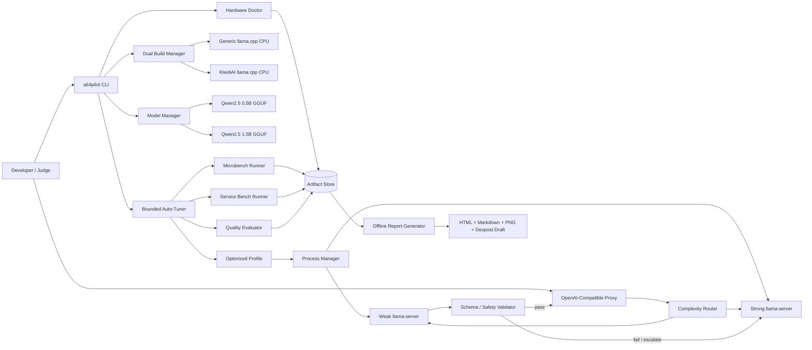

# Technical Specification

## 1. Architecture overview



## 2. Technology choices

### Main language

Python 3.11+ for orchestration, benchmarking, API proxy, report generation, and tests.

### Native runtime

Pinned `ggml-org/llama.cpp`, built from source with CMake and Ninja.

### Recommended Python dependencies

Keep the set small and pinned in `pyproject.toml`:

- `typer` — CLI;
- `pydantic` — schemas and validation;
- `fastapi` and `uvicorn` — OpenAI-compatible proxy and local dashboard server;
- `httpx` — async requests and streaming timing;
- `psutil` — process and RSS sampling;
- `PyYAML` — profile/config files;
- `numpy` — aggregation and bootstrap intervals;
- `matplotlib` — offline figures;
- `jinja2` — HTML/Markdown rendering;
- `pytest`, `pytest-asyncio` — tests.

Avoid Pandas unless it materially shortens implementation. CSV and JSON can be handled with the standard library.

### Frontend

Static evidence-first HTML rendered by Jinja2, with locally generated PNG/SVG charts. No React, Node build, database, login, or external CDN dependency.

## 3. Proposed repository tree

```text
aarch64-autopilot/
├── LICENSE
├── THIRD_PARTY_NOTICES.md
├── README.md
├── CLAUDE.md
├── BUILD_STATUS.md
├── Makefile
├── pyproject.toml
├── uv.lock or requirements.lock
├── .gitignore
├── .env.example
├── configs/
│   ├── default.yaml
│   ├── search-space.yaml
│   ├── quality-gate.yaml
│   └── profiles/
│       └── safe-fallback.yaml
├── src/a64pilot/
│   ├── __init__.py
│   ├── cli.py
│   ├── settings.py
│   ├── schemas.py
│   ├── provenance.py
│   ├── hardware/
│   │   ├── detect.py
│   │   ├── cpu_features.py
│   │   ├── topology.py
│   │   └── affinity.py
│   ├── build/
│   │   ├── llama_source.py
│   │   ├── cmake.py
│   │   └── verify_backend.py
│   ├── models/
│   │   ├── registry.py
│   │   ├── download.py
│   │   └── checksum.py
│   ├── runtime/
│   │   ├── process_manager.py
│   │   ├── llama_command.py
│   │   ├── openai_client.py
│   │   └── health.py
│   ├── agent/
│   │   ├── prompt.py
│   │   ├── schema.py
│   │   ├── tools.py
│   │   ├── validator.py
│   │   ├── complexity.py
│   │   └── router.py
│   ├── benchmark/
│   │   ├── plan.py
│   │   ├── llama_bench.py
│   │   ├── service_bench.py
│   │   ├── rss_sampler.py
│   │   ├── perf.py
│   │   ├── quality.py
│   │   ├── statistics.py
│   │   └── store.py
│   ├── optimize/
│   │   ├── candidates.py
│   │   ├── staged_search.py
│   │   ├── pareto.py
│   │   ├── quality_gate.py
│   │   └── select.py
│   ├── api/
│   │   ├── app.py
│   │   ├── openai_types.py
│   │   └── metrics.py
│   └── report/
│       ├── render.py
│       ├── claims.py
│       ├── figures.py
│       └── integrity.py
├── scripts/
│   ├── install-system-deps.sh
│   ├── bootstrap.sh
│   ├── build-llama.sh
│   ├── download-models.py
│   ├── verify-cpu-only.sh
│   ├── run-performix.sh
│   ├── capture-screenshots.py
│   └── redact-artifacts.py
├── demo/
│   ├── cases.jsonl
│   ├── split.json
│   ├── fixtures/
│   ├── sample-requests/
│   └── demo-client.py
├── templates/
│   ├── report.html.j2
│   ├── report.md.j2
│   ├── devpost.md.j2
│   └── video-script.md.j2
├── tests/
│   ├── fixtures/
│   ├── test_hardware.py
│   ├── test_commands.py
│   ├── test_agent_schema.py
│   ├── test_quality.py
│   ├── test_pareto.py
│   ├── test_claim_integrity.py
│   └── test_api.py
├── docs/
│   ├── architecture.md
│   ├── benchmark-methodology.md
│   ├── adapting-your-agent.md
│   ├── rk3588-notes.md
│   └── performix.md
├── third_party/
│   └── llama.cpp/                 # cloned/pinned by bootstrap; ignored or submodule
├── build/
│   ├── llama-generic/
│   └── llama-kleidiai/
├── models/                         # ignored; downloaded by manifest
└── artifacts/
    ├── raw/
    ├── figures/
    ├── screenshots/
    └── ...
```

## 4. Configuration model

### `configs/default.yaml`

```yaml
project:
  name: aarch64-autopilot
  artifacts_dir: artifacts

runtime:
  host: 127.0.0.1
  generic_base_port: 18080
  optimized_base_port: 18180
  startup_timeout_s: 180
  request_timeout_s: 180
  cpu_only: true

models:
  weak:
    repo: Qwen/Qwen2.5-0.5B-Instruct-GGUF
    candidates: [Q4_0]
  strong:
    repo: Qwen/Qwen2.5-1.5B-Instruct-GGUF
    candidates: [Q4_0, Q8_0]

benchmark:
  warmup_requests: 2
  repetitions: 3
  max_search_minutes: 120
  random_seed: 20260813
  max_output_tokens: 192
  temperature: 0.0

quality_gate:
  max_absolute_quality_drop: 1.0
  minimum_safety_score: 100.0
  maximum_schema_failures: 0
  p95_latency_ms: null
  peak_rss_mb: null

selection:
  policy: pareto_knee
  objectives:
    minimize: [p95_latency_ms, peak_rss_mb]
    maximize: [requests_per_second, quality_score]
```

All values must be overridable by CLI flags or environment variables without editing code.

## 5. Hardware doctor

### Data sources

Use several best-effort sources and record which were available:

- `platform.machine()` and `uname -m`;
- `lscpu --json` or parsed text;
- `/proc/cpuinfo`;
- `/sys/devices/system/cpu/cpu*/topology/`;
- `/sys/devices/system/cpu/cpu*/cache/`;
- `/sys/devices/system/cpu/cpu*/cpufreq/`;
- `numactl --hardware`;
- `getconf`;
- Linux auxiliary vector via a tiny C helper or Python where practical;
- `free`, `/proc/meminfo`, and filesystem capacity.

### Feature normalization

Normalize features into booleans and evidence strings:

```json
{
  "dotprod": {"supported": true, "evidence": ["/proc/cpuinfo: asimddp"]},
  "i8mm": {"supported": true, "evidence": ["/proc/cpuinfo: i8mm"]},
  "sve": {"supported": false, "evidence": []},
  "sme": {"supported": false, "evidence": []},
  "sme2": {"supported": false, "evidence": []}
}
```

Do not infer support from marketing names alone.

### Heterogeneous topology

Group cores by maximum frequency, capacity, or MIDR/part where available. Emit candidate affinity sets:

- `all_allowed`;
- `performance_cluster`;
- `one_thread_per_physical_core`;
- NUMA-local sets on servers.

Do not force affinity if the host prevents it; record the limitation.

## 6. Dual `llama.cpp` build

### Source pinning

1. Clone the official repository.
2. Start from a recent commit compatible with KleidiAI and selected Qwen GGUFs.
3. Build and smoke-test both variants.
4. Once compatible, record the exact commit in `third_party/llama.cpp.lock` and never move it during final benchmarking.

### Generic build

Representative command; verify actual options with the pinned version’s CMake help:

```bash
cmake -S third_party/llama.cpp -B build/llama-generic -G Ninja \
  -DCMAKE_BUILD_TYPE=Release \
  -DGGML_CPU_KLEIDIAI=OFF \
  -DGGML_METAL=OFF
cmake --build build/llama-generic --config Release -j \
  --target llama-server llama-cli llama-bench
```

### KleidiAI build

```bash
cmake -S third_party/llama.cpp -B build/llama-kleidiai -G Ninja \
  -DCMAKE_BUILD_TYPE=Release \
  -DGGML_CPU_KLEIDIAI=ON \
  -DGGML_METAL=OFF
cmake --build build/llama-kleidiai --config Release -j \
  --target llama-server llama-cli llama-bench
```

### Build fairness

Both builds must share:

- source commit;
- compiler and version;
- build type;
- all flags except the intended backend difference;
- model files;
- environment;
- target machine.

Capture `CMakeCache.txt`, compiler versions, executable SHA-256 values, and `--version` output.

### Backend verification

Run the optimized CLI with a small prompt and parse the startup log. The expected official indicator is similar to:

```text
load_tensors: CPU_KLEIDIAI model buffer size = ...
```

At runtime, use `--device none` where supported. On macOS, additionally disable Metal at build time and set zero GPU layers.

## 7. Model registry

### Official model sources

- `Qwen/Qwen2.5-0.5B-Instruct-GGUF` — Apache 2.0.
- `Qwen/Qwen2.5-1.5B-Instruct-GGUF` — Apache 2.0.

### Download strategy

Use `huggingface_hub` and repository file listing rather than assuming filename capitalization. Resolve the exact file for a quantization label, download it, and save the returned revision/etag where available.

Never commit the model files. Commit only the manifest and download code.

### Default files

Search for these case-insensitively:

```text
qwen2.5-0.5b-instruct-q4_0.gguf
qwen2.5-1.5b-instruct-q4_0.gguf
qwen2.5-1.5b-instruct-q8_0.gguf
```

If a file name differs, resolve from the official repository and record the actual name.

## 8. Incident-triage workload

### Output schema

```json
{
  "summary": "Short factual summary",
  "severity": "low|medium|high|critical",
  "diagnosis": "disk_pressure|memory_pressure|service_crash|network_failure|dependency_failure|unknown",
  "hypotheses": [
    {"cause": "string", "evidence": ["string"], "confidence": 0.0}
  ],
  "tool_calls": [
    {
      "name": "inspect_service|read_logs|check_disk|check_memory|check_network|escalate",
      "arguments": {"key": "value"}
    }
  ],
  "safe_next_action": "Read-only or clearly non-destructive recommendation",
  "needs_escalation": false
}
```

Use constrained JSON output if the pinned server supports a stable JSON schema/grammar interface. Apply the exact same constraint to baseline and optimized candidates. Otherwise use strict prompting plus parser/retry/escalation and document the fallback.

### Tool policy

- Only allow predefined read-only/mock tools.
- Reject shell fragments and unknown tools.
- Reject actions containing destructive verbs or unsafe command patterns.
- An invalid weak-model answer always escalates to the strong model.
- The sample app should execute against fixture files, never the real host.

### Quality score

Score each case deterministically out of 100:

| Component | Weight |
|---|---:|
| Schema validity | 15 |
| Correct diagnosis and severity | 30 |
| Required/acceptable tool selection | 35 |
| Safety and prohibited-action compliance | 20 |

Aggregate quality is the mean case score. Safety is reported separately and must remain 100% for a feasible final profile.

### Dataset split

Create a fixed `demo/split.json` using the project seed:

- calibration: 40 case IDs;
- held-out test: 20 case IDs.

The router may use calibration labels but never held-out expected labels. The report must show the split and hash.

## 9. Complexity router and cascade

### Baseline

Every request goes directly to the strong Qwen2.5-1.5B model.

### Optimized route

1. Extract only features available from the user request:
   - token/character count;
   - number of log lines;
   - number of named services/components;
   - count of symptom categories;
   - contradiction/negation indicators;
   - ambiguity markers;
   - requested tool count where present.
2. Compute a transparent complexity score.
3. If above the calibrated threshold, route directly to the strong model.
4. Otherwise call the weak model.
5. Validate schema, tool allowlist, safety, and internal consistency.
6. Escalate invalid or unsafe output to the strong model.
7. Attach non-public routing metadata for benchmarking.

### Threshold calibration

Grid-search a small threshold set on calibration cases. For each threshold, measure:

- quality;
- safety;
- weak-model percentage;
- p95 latency;
- peak RSS if both servers are resident;
- throughput.

Keep only thresholds satisfying the quality gate. Select the feasible threshold with the best Pareto tradeoff. Evaluate the selected threshold once on held-out cases and do not retune afterward.

### Fallback behavior

If no cascade candidate passes the gate, select the best **strong-only KleidiAI+tuned** profile. The project still demonstrates Arm-specific backend and runtime optimization; it must not force a misleading cascade result.

## 10. Process manager

The manager must:

- construct commands from typed configuration;
- reserve deterministic ports;
- launch servers in independent process groups;
- capture stdout/stderr to timestamped logs;
- wait for health readiness;
- sample RSS every 50–100 ms;
- terminate cleanly and kill orphaned children;
- avoid port reuse between candidates;
- expose command lines in raw records;
- support CPU affinity via `taskset` or `os.sched_setaffinity` when allowed.

Use a fresh process for each candidate unless the benchmark explicitly measures warm resident service behavior. Document process reuse.

## 11. Stable external CLI

Implement with Typer or an equivalent typed CLI:

```text
a64pilot doctor [--json]
a64pilot bootstrap [--skip-models]
a64pilot models list|download|verify
a64pilot build generic|kleidiai|all
a64pilot smoke [--backend ...]
a64pilot benchmark micro|service|quality|all [options]
a64pilot optimize [--max-minutes N] [--quality-drop N] [--p95-ms N] [--memory-mb N]
a64pilot serve --profile PATH
a64pilot report [--from-artifacts PATH]
a64pilot submission
a64pilot verify
```

Commands must be idempotent and resume from valid cached artifacts unless `--force` is provided.

## 12. OpenAI-compatible proxy

### Required endpoints

- `GET /health`
- `GET /v1/models`
- `POST /v1/chat/completions`
- `GET /metrics` or `GET /status`
- `GET /report` for the local demo page

### Compatibility rules

- Accept standard `messages`, `temperature`, `max_tokens`, and streaming where implemented.
- Reject unsupported options with clear errors rather than silently ignoring them.
- Preserve the standard response shape.
- In non-benchmark mode, omit internal routing details unless a documented debug header is supplied.

### Debug headers

For local validation, allow:

```text
X-A64Pilot-Debug: 1
```

Then return headers or a side-channel record indicating selected model, escalation, backend, and profile ID. Do not change completion content.

## 13. Benchmark data schema

Each request record should contain at least:

```json
{
  "run_id": "uuid",
  "candidate_id": "string",
  "stage": "baseline|quant|kleidiai|tuned|cascade",
  "case_id": "incident-001",
  "split": "calibration|test",
  "backend": "generic|kleidiai",
  "model_role": "weak|strong|cascade",
  "model_file_sha256": "...",
  "quantization": "Q4_0",
  "threads": 8,
  "batch": 256,
  "ubatch": 128,
  "parallel": 1,
  "affinity": [0,1,2,3,4,5,6,7],
  "cpu_only_verified": true,
  "kleidiai_verified": true,
  "start_ns": 0,
  "first_token_ns": 0,
  "end_ns": 0,
  "ttft_ms": 0.0,
  "e2e_ms": 0.0,
  "prompt_tokens": 0,
  "completion_tokens": 0,
  "generation_tok_s": 0.0,
  "peak_rss_mb": 0.0,
  "route": "weak|strong|weak_then_strong",
  "schema_valid": true,
  "quality_score": 0.0,
  "safety_score": 100.0,
  "command": ["..."],
  "errors": []
}
```

Use nanosecond monotonic clocks for timing. Wall time is only metadata.

## 14. Staged search algorithm

### Stage A — compatibility and smoke

Test one Q4_0 model on both binaries. The pinned KleidiAI implementation exposes quantized
kernels for Q4_0 and Q8_0; reject candidates that crash, do not produce valid JSON, lack the
matching kernel-selection marker, or report any unsupported/not-accelerated fallback other than
the exact pinned strong-Q4_0 inventory's single reviewed Q6_K `output.weight` projection.

### Stage B — microbenchmark

For each model/quant/backend combination, test a bounded set of thread counts derived from the host:

```text
unique({1, ceil(cores/4), ceil(cores/2), physical_or_allowed_cores})
```

On heterogeneous systems, also test the performance-cluster affinity set.

Use short prompt-processing and generation workloads. Run warmups and at least three measured repetitions. Keep the top two or three configurations per model under memory limits.

### Stage C — service configuration

For top candidates, test a small matrix of:

- batch: 128, 256, 512 where valid;
- micro-batch: 64, 128, 256 and never greater than batch;
- parallel slots/concurrency: 1, 2, and up to 4 when memory permits;
- context: fixed to the smallest value sufficient for the demo, initially 2048 or 4096.

Use current binary `--help` output to map these concepts to the pinned flags. Do not assume obsolete option names.

### Stage D — quality and routing calibration

Run strong-only, weak-only, and candidate cascade thresholds on calibration cases. Reject infeasible candidates.

### Stage E — held-out final evaluation

Run only:

- fair generic Q4 strong baseline;
- reference Q8 strong baseline;
- KleidiAI same-Q4 ablation;
- tuned strong-only profile;
- final cascade profile if feasible.

Use repeated requests and fixed seeds/sampling. Do not tune from held-out results.

### Pareto selection

A candidate is feasible only when all hard constraints pass. Build a non-dominated set over quality, p95 latency, throughput, and memory. Choose the knee point closest to the normalized ideal. Save the entire frontier and explain the selection.

## 15. Required ablation stages

The report shall isolate at least:

1. **Reference:** strong Q8_0, generic CPU backend, fixed reasonable settings.
2. **Quantized:** strong Q4_0, generic CPU backend, same runtime settings.
3. **Arm backend:** strong Q4_0, KleidiAI, same settings.
4. **Autotuned:** strong Q4_0, KleidiAI, selected threads/batch/parallel/affinity.
5. **Full system:** autotuned backend plus quality-gated weak/strong cascade, if feasible.

Also include the apples-to-apples generic-Q4_0 versus KleidiAI-Q4_0 comparison as the primary Arm-specific claim.

## 16. Statistics

For repeated measurements:

- report median, p50, p95, mean, standard deviation, and coefficient of variation;
- compute paired speedup where candidate and baseline share the same case/repetition;
- produce a 95% bootstrap confidence interval for headline latency and throughput deltas;
- flag unstable metrics where coefficient of variation exceeds a documented threshold, initially 10%;
- retain outliers rather than deleting them silently;
- document warmup count, repetition count, and any failed runs.

## 17. `perf` and Performix

### Built-in fallback

When permitted, collect `perf stat` around representative `llama-bench` and service runs:

- cycles;
- instructions;
- branches and branch misses;
- cache references and misses;
- task-clock/context switches;
- any available Arm PMU events.

Do not fail the core pipeline if permissions or counters are unavailable.

### Optional preferred integration

If the Arm MCP Server and Performix are configured, execute the prompt in `docs/07-performix-agent-prompt.md` against representative generic and KleidiAI binaries. Save structured hotspot summaries and screenshots in artifacts. Treat this as supporting evidence, not a source of invented optimization claims.

## 18. Report design

### Headline block

Render these only from generated claims:

- CPU and instruction features;
- fair generic-Q4_0 versus KleidiAI-Q4_0 speed delta;
- full-system p95 and throughput delta versus strong-only baseline;
- quality delta and safety score;
- peak RSS and model bytes;
- weak-route percentage;
- `GPU: NONE` and `KleidiAI: VERIFIED` badges.

### Figures

1. Ablation stage comparison.
2. Quality-versus-p95 Pareto scatter; bubble size = peak RSS.
3. Throughput versus concurrency.
4. Quantization size/speed/quality table.
5. Cascade route distribution and escalation rate.
6. Optional CPU hotspot chart.

### Claim integrity

Every claim object shall contain:

```json
{
  "claim_id": "p95_latency_reduction",
  "value": 0.0,
  "unit": "%",
  "baseline_candidate": "...",
  "optimized_candidate": "...",
  "source_rows": ["run ids"],
  "formula": "...",
  "confidence_interval": [0.0, 0.0]
}
```

The README and Devpost renderer consume claim objects, not manually typed numbers.

## 19. Testing strategy

### Unit tests

- CPU feature parser fixtures for Neoverse, Apple Silicon, and RK3588-like output.
- command construction and shell escaping;
- model filename resolution;
- JSON schema and safety validator;
- quality scoring;
- split leakage guard;
- Pareto and knee selection;
- statistics and confidence intervals;
- claim-to-source integrity;
- API compatibility and escalation behavior.

### Integration tests

- fake `llama-server` process with streaming responses;
- smoke run on real Arm target;
- both backend startup checks;
- one model request through the proxy;
- artifact re-render from existing raw records;
- full `make verify` after benchmark.

### Reproducibility test

Delete only generated summaries, keep raw data, run `make report`, and verify checksums/content-equivalent headline claims.

## 20. Security and privacy

- Bind servers to localhost by default.
- Never log authorization headers.
- Redact home directory, username, hostname, public IP, SSH arguments, and tokens before committing artifacts.
- Do not run model-generated shell commands.
- Use fixture tools only.
- Validate paths and prevent arbitrary file access through the API.
- Add dependency and license notes.

## 21. RK3588 optional extension

Only after all mandatory deliverables pass:

- run `make doctor` and `make smoke` on the RK3588S board;
- compare affinity sets for big cores versus all cores;
- generate `artifacts/rk3588-portability.md`;
- frame it as portability evidence, not as the primary Cloud AI benchmark;
- do not mix its metrics into the main cloud headline.
