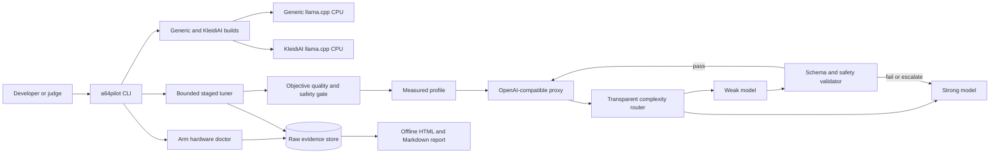

# Architecture

The runtime and report layers are intentionally separate. A model response can demonstrate
API behavior in fixture mode, but only measured, CPU-only rows with verified binary/model
provenance enter the claim generator.
